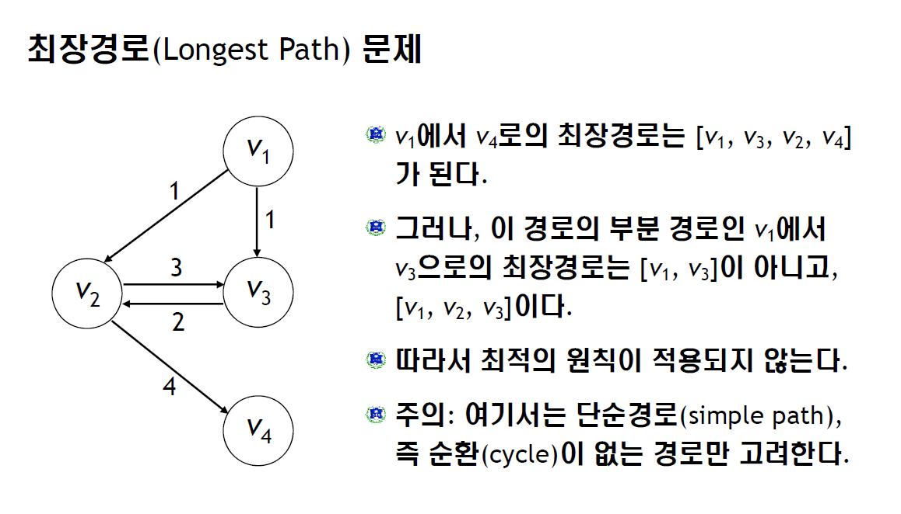

# 4. Dynamic Programming -- 2015/10/05(月) 이상열 

- Dynamic sequential or temporal component to the problem Programming optimising a program", i.e. a policy 
    - c.f. linear programming 
    - 선형계획법 예제 모형 
    - 각 제품의 원료사용량과 단위당 이익(T 화학의 경우)  

| 제품 | 원료A  | 원료B  | 원료C  | 단위당이익(만원) |
|---|---|---|---|---|
| 가 | 4 | 0 | 6 | 40 |
| 나 | 5 | 2 | 3 | 30 |

    - 각 원료의 주간 사용가능량 : 200톤, 50톤, 210톤, 총이익을 최대로 하는 생산계획을 수립이 목표 
    - 의사결정변수 X1 : 제품 가 의 주간 생산량 , X2 : 제품 나 의 주간 생산량, 목적함수, 제약조건, 비음조건으로 문제를 풀자

- A method for solving complex problems By breaking them down into subproblems 
    - Solve the subproblems 
    - Combine solutions to subproblems
    

- 엄밀히 말해 동적 계획법은 구체적인 알고리즘이라기보다는 문제해결 패러다임에 가깝다. 동적 계획법은 "어떤 문제를 풀기위해 그 문제를 더 작은 문제의 연장선으로 생각하고, 과거에 구한 해를 활용하는" 방식의 알고리즘을 총칭한다. 동적 계획법을 써야 좋은 효과를 얻을 수 있는 문제들은 주로 Optimal Substructure라고 불리는 구조를 가진 것들이다. 쉽게 이야기하면, 뭘 구하기 위해서 했던 계산을 또하고 또하고 계속해야하는 류의 문제를 풀 때 동적 계획법이 효과를 발휘한다는 것. (출처: https://namu.wiki/w/%EB%8F%99%EC%A0%81%20%EA%B3%84%ED%9A%8D%EB%B2%95)

- ###*Dynamic Programming is a very general solution method for problems which have two properties*

- Optimal substructure (최적 부분구조 ; 큰 문제의 최적 솔루션에 작은 문제의 최적 솔루션이 포함됨)
    - Principle of optimality applies (최적의 행동을 위해 행동을 결정할 때 그 종료시점까지의 모든 결정이 반영됨)
    - Optimal solution can be decomposed into subproblems (

- Overlapping subproblems (서브문제로 중복)
    - Subproblems recur many times 
    - Solutions can be cached and reused

- Markov decision processes satisfy both properties
    - Bellman equation gives recursive decomposition
    - Value function stores and reuses solutions     


- MDP와 같은 환경의 완전한 모델이 주어진 최적 정책(policy)을 계산하기 위해 사용하는 알고리즘의 집합. The term dynamic programming (DP) refers to a collection of algorithms that can be collection of algorithms that can be used to compute optimal policies given a perfect optial policies given a perfect model of the environment as a Markov decision environment as a Markov decision process (MDP). 

- 고전적인 동적프로그래밍 알고리즘은 완전한 모델에서 많은 계산양 때문에 강화학습에서 제한적이였음. Classical DP algorithms are of limited utility in reinforcement learning both because of their assumption of a perfect model and because of their great computational expense, but they are still important theoretically.

- 완전한 모델 가정을 완화. Less computation and without assuming a perfect model of the environment.

- 제한적인 MDP (상태,액션 셋의 전이행렬이 제한적)A finite MDP (Assume) / state and action sets (Finite, given by a set of transition probabilites) 

- Approximate solutions (continuous state and action spaces를 정량화하면)

>*상태 가치 함수(Stae value function)의 벨만 방정식*
>
> V'(s) = 
>      = 

>*상태-액션 가치 함
> Q*(S,A) = 
>        = 
        
- for all ,  , and  . As we shall see, DP algorithms are obtained by turning Bellman equations such as these into assignments, that is, into update rules for improving approximations of the desired value functions


```python
# Overlapping Subproblems http://20bits.com/article/introduction-to-dynamic-programming
```


```python
def fib(n):
	if n == 0: return 0
	if n == 1: return 1
	return fib(n-1) + fib(n-2)
```


```python
fib(3)
```


    2


```python
fib(10)
```


    55


```python
fib(5)
fib(4) + fib(3)
fib(3) + fib(2) + fib(2) + fib(1)
fib(2) + fib(1) + fib(1) + fib(0) + fib(1) + fib(0) + fib(1)
fib(1) + fib(0) + fib(1) + fib(1) + fib(0) + fib(1) + fib(0) + fib(1)
```


    5


| (a,b) | 그냥 계산시 연산횟수  | 동적계획법 이용시 연산횟수 |
|---|---|---|---|---|
| (2,2) | 6 | 5 |
| (4,4) | 70 | 17 |
| (6,8) | 3003 | 49 |
| (10,10) | 184756 | 101 |


```python
def fib2(n):
	n2, n1 = 0, 1
	for i in range(n-2): 
		n2, n1 = n1, n1 + n2
	return n2+n1
```

- k번째 단계에서 우리는 fiB (K-1) 및 fiB (K-2)의 값을 알 필요가 있지만, 우리는 서로를 여러 번 호출하는 바람. 아래에서부터 시작하여 우리가 방대한 중복을 제거, 다음 단계에 필요한 숫자를 계산할 수 올라감. (At the kth stage we only need to know the values of fib(k-1) and fib(k-2), but we wind up calling each multiple times. Starting from the bottom and going up we can calculate the numbers we need for the next step, removing the massive redundancy. )

- fib2 기능은 O(N) 시간이 걸리는 반면 fIB 기능은 N의 지수, 즉, O(CN승) 시간이 걸립니다.(In Big-O notation the fib function takes O(cn) time, i.e., exponential in n, while the fib2 function takes O(n) time. If this is all too abstract take a look at this graph comparing the runtime (in microseconds) of fib and fib2 versus the input parameter) 

> 

### Optimal Substructure
- 문제는 전역 최적해가 하위 문제에 국부적 최적해로부터 구성 될 수있는 경우에 최적의 서브 구조를 말한다. 최적의 하부 구조가 롤을 재생하는 문제의 일반적인 형태는 이런 식입니다. 이제 특정 제약 아마 될 수있는 최대 (또는 최소) 비용의 일부를 찾을 수 있습니다.(A problem is said to have optimal substructure if the globally optimal solution can be constructed from locally optimal solutions to subproblems. The general form of problems in which optimal substructure plays a roll goes something like this. Let's say we have a collection of objects called A. For each object o in A we have a "cost," c(o). Now find the subset of A with the maximum (or minimum) cost, perhaps subject to certain constraints.) 

-  무차별 방법은 모든 서브 세트를 생성 비용을 계산하고 그 값 중에서 최대 (또는 최소)을 발견하는 것이다. 그러나 N(A)에는 제한이 때때로이 없는 경우의 요소는 우리가 크기 2N의 검색 공간을 찾고 있습니다 N 무차별 방법은 계산이 불가능하게 큰 경우. 예제를 살펴 보자. The brute-force method would be to generate every subset of A, calculate the cost, and then find the maximum (or minimum) among those values. But if A has n elements in it we are looking at a search space of size 2n if there are no constraints on A. Oftentimes n is huge making a brute-force method computationally infeasible. Let's take a look at an example. 

- Maximum Subarry Sum

-  정수의 배열이 있다고 가정해 봅시다. 연속적인 배열에서 값을 더해 큰 값을 찾는 문제. [1,2,-5,4,7,-2]에서 연속적인 배열의 합이 가장 큰 값은 [4,7] 이므로 더하면 11. Let's say we're given an array of integers. What (contiguous) subarray has the largest sum? For example, if our array is [1,2,-5,4,7,-2] then the subarray with the largest sum is [4,7] with a sum of 11. 

- One might think at first that this problem reduces to finding the subarray with all positive entries, if one exists, that maximizes the sum. But consider the array [1,5,-3,4,-2,1]. The subarray with the largest sum is [1, 5, -3, 4] with a sum of 7. 

- First, the brute-force solution. Because of the constraints on the problem, namely that the subsets under consideration are contiguous, we only have to check O(n2) subarrays (why?). Here it is, in Python: 


```python
def msum(a):
	return max([(sum(a[j:i]), (j,i)) 
                for i in range(1,len(a)+1) 
                for j in range(i)])
```


```python
example = [1,2,-5,4,7,-2]
```


```python
msum(example)
```


    (11, (3, 5))


- This returns both the sum and the offsets of the subarray. Let's see if we can't find an optimal substructure to exploit. 

- We are given an input array a. I'm going to use Python notation so that a[0:k] is the subarray starting at 0 and including every element up to and including k-1. Let's say we know the subarray of a[0:i] with the largest sum (and that sum). Using just this information can we find the subarray of a[0:i+1] with the largest sum? 

- Let a[j:k+1] be the optimal subarray, t the sum of a[j:i], and s the optimal sum. If t+a[i] is greater than s then set a[j:i+1] as the optimal array and set s = t. If t + a[i] is negative, however, the contiguity constraint means that we cannot include a[j:i+1] in our subarray since any such subarray will have a smaller sum than a subarray without it. So, if t+a[i] is negative set t = 0 and set the left-hand bound of the optimal subarray to i+1. 

- To visualize consider the array [1,2,-5,4,7,-2]. 


```python
Set s = -infinity, t = 0, j = 0, bounds = (0,0)
(1   2  -5   4   7  -2 
(1)| 2  -5   4   7  -2  (set t=1.  Since t > s, set s=1 and bounds = (0,1))
(1   2)|-5   4   7  -2  (set t=3.  Since t > s, set s=3, and bounds = (0,2))
 1   2  -5(| 4   7  -2  (set t=-2. Since t < 0, set t=0 and j = 3 )
 1   2  -5  (4)| 7  -2  (set t=4.  Since t > s, set s=4 and bounds = (3,4))
 1   2  -5  (4   7)|-2  (set t=11. Since t > s, set s=11 and bounds = (3,5))
 1   2  -5  (4   7) -2| (set t=9.  Nothing happens since t < s)
```


```python
def msum2(a):
	bounds, s, t, j = (0,0), -float('infinity'), 0, 0
	
	for i in range(len(a)):
		t = t + a[i]
		if t > s: bounds, s = (j, i+1), t
		if t < 0: t, j = 0, i+1
	return (s, bounds)
```


```python
msum2(example)
```


    (11, (3, 5))


- 배열을 통해 단지 세 개의 변수를 추적함. 각각의 단계에서 하나의 패스를 필요 현재 지점에 경계의 왼쪽 에지로부터 합 (t)를, 최대 합 (S) 현재 최적의 부분 배열 (bound).(This requires only one pass through the array and at each step we're only keeping track of three variables: the current sum from the left-hand edge of the bounds to the current point (t), the maximal sum (s), and the bounds of the current optimal subarray (bounds)).

- 이미 본 것에 대해서만 의사결정하는 최적 솔루션. In this problem the "globally optimal" solution corresponds to a subarray with a globally maximal sum, but at each each step we only make a decision relative to what we have already seen. That is, at each step we know the best solution thus far, but might change our decision later based on our previous information and the current information. This is the sense in the problem has optimal substructure. Because we can make decisions locally we only need to traverse the list once, reducing the run-time of the solution to O(n) from O(n2). Again, a graph:

## 4.1 정책반복법(Policy Evaluation)
- 최적 의사결정 및 최적 제어문제의 해를 구하기 위한 반복계산 기법이다. 정책평가(policy evaluation) 루틴과 정책향상(policy improvement) 루틴으로 구성되어 있으며, 이 두개의 루틴을  교대로 반복실행하여 최적화 문제를 해결한다. 여기서, 정책평가 루틴은 현재 에이전트 (agent)의 행동에 대한 가치함수 (value function)을 정확히 추정하여 에이전트의 성능을 평가하고, 정책향상 루틴은 추정된 가치함수를 기반으로 에이전트의 성능을 향상시키는 역할을 한다. (연속시간 선형시스템에 대한 탐색화된 정책반복법 논문 참조)

- Finite MDP의 optimal policy를 구하는 대표적인 두 알고리즘으로는 value iteration과 policy iteration이라는 알고리즘이 존재한다. 두 알고리즘은 이름에서 알 수 있듯 모두 iterative algorithm이며, 위에서 언급한 intuition이 그대로 적용되는 알고리즘들이다. 즉, initial state에 invariant하며 iteration 동안 value function이 monotonically increase한다. 그리고 그 값이 converge하게 되면 우리가 원하는 optimal policy를 구할 수 있다.

- First we consider how to compute the state-value function  for an arbitrary policy . This is called policy evaluation in the DP literature. We also refer to it as the prediction problem.

>*임의에 정책에 따른 상태 가치 함수*
>V파이(s) = 
>        = 
>       = 

- where 파이(s,a) is the probability of taking action  in state  under policy , v파이(s)는 미지수. 그래서 해결방법은 번거로운 반복 해법(iterative solution). value function를 근사화함. 각 매핑에 대해서 초기 근사치가 임의로 선택. 각각의 연속 근사 업데이트 규칙이 적용

>*임의의 k에 따른 상태 가치 함수*
> Vk+1'(s) = 
>          = 

- Vk = V파이(s) Vk의 시퀀스. k가 무한대로 가면 수렴함. 
- 반복적 정책 평가는 각 상태에 동일한 동작을 적용에서, 각각의 연속적인 근사화를 생산. 정책에 따라 가능한 모든 한 단계 전환이 평가되고 따라서는 후임 상태의 이전 값에서 얻은 새 값과 예상 즉각적인 보상으로의 이전 값을 대체합니다. 작업의 이런 종류의 전체 백업을 호출합니다. 반복적인 정책 평가의 각 반복은 새로운 근사값 기능을 생산하기 위해 한 번 모든 상태의 값을 백업합니다. 
- 반복적인 정책 평가를 구현하기 위해 순차적으로 컴퓨터 프로그램을 작성하려면, 두 배열이 필요, 이전 값에 하나, 새로운 값 하나를 사용해야 합니다.
- 이전의 값이 변경되지 않고,이 방법은, 새로운 값이 이전 값으로부터 하나씩 계산 될 수있다. 물론 각각의 새로운 백업 값이 바로 이전을 덮으므로(장소의 값을 업데이트) 하나의 배열을 사용하는 것.
- 반복적인 정책 평가를 위한 전형적인 정지 조건은 각 반복후 테스트하고 충분히 작은 경우 중지하는 것.
- This is an undiscounted, episodic task(종결 상태가 있는 작업), The initial approximation, , is chosen arbitrarily 
> Iterative policy evaluation
> 
> 

- 작은 gridworld에 반복적인 정책 평가의 수렴. 왼쪽 열은 임의의 정책에 대한 상태 값 함수의 근사의 순서 (모든 동작은 동일)입니다.우측 열은 함수값 추정치에 대응 욕심 정책 시퀀스이다. 마지막 정책은 임의의 정책에 개선이 보장되지만 이 경우 세번째 반복 후 모든 정책에 최적이다. Convergence of iterative policy evaluation on a small gridworld. The left column is the sequence of approximations of the state-value function for the random policy (all actions equal). The right column is the sequence of greedy policies corresponding to the value function estimates (arrows are shown for all actions achieving the maximum). The last policy is guaranteed only to be an improvement over the random policy, but in this case it, and all policies after the third iteration, are optimal.


## 4.2 Policy Improvement
- 정책의 가치 함수를 계산하는 이유는 더 나은 정책을 찾을라고 하는 것입니다. 임의의 비확률적(결정적) 정책에 대한 value function을 결정했다고 가정하자. 일부 상태의 경우 결정론적 행동을 선택할 수있는 정책을 변경해야 하는지 여부를 알고 싶습니다. 그러나 그것이 좋든 나쁜 새 정책을 변경하는 것입니다 즉 현재의 정책을 따르는 것이 좋다는 걸 안다면. 이 질문에 대답하는 한 가지 방법은, 기존 정책을 다음과 이후에 거기 선택 고려하는 것입니다. 행동하는 이러한 방법의 값은 Our reason for computing the value function for a policy is to help find better policies. Suppose we have determined the value function  for an arbitrary deterministic policy . For some state  we would like to know whether or not we should change the policy to deterministically choose an action . We know how good it is to follow the current policy from --that is --but would it be better or worse to change to the new policy? One way to answer this question is to consider selecting  in  and thereafter following the existing policy, . The value of this way of behaving is 

> Q파이(s,a) = 
>            = 

- 중요한 기준은,이보다 크거나보다 작은 지의 여부이다. 가 큰 경우 - 즉, 그것은 항상 수행하는 것보다 수행 후 한번 선택하는 것이 낫다 경우이다 - 다음 하나가 발생 될 때마다 선택하는 것이 여전히 더 좋을을 기대하고 그 새로운 정책은 실제로 더 나은 하나의 전체가 될 것입니다. 이 사실이라고하면 정책 개선의 정리라는 일반적인 결과의 특별한 경우이다. 하자 등, 그 모든 결정 정책의 쌍을, The key criterion is whether this is greater than or less than . If it is greater--that is, if it is better to select  once in  and thereafter follow  than it would be to follow  all the time--then one would expect it to be better still to select  every time  is encountered, and that the new policy would in fact be a better one overall. That this is true is a special case of a general result called the policy improvement theorem. Let  and  be any pair of deterministic policies such that, for all , 

> 

- 그런 다음 정책은만큼 좋은, 또는보다 더해야합니다. 즉, 모든 상태에서 크거나 같은 예상 수익을 확보해야한다 : Then the policy  must be as good as, or better than, . That is, it must obtain greater or equal expected return from all states : 

> 

- 어떤 상태에서 (4.7)의 엄격한 불평등이 있는 경우 • 또한, 다음, 적어도 하나의 상태에서 (4.8)의 엄격한 불평등이 있어야합니다. 이 결과가 우리가 이전 단락에서 고려 두 정책 결정 원래 정책 및 변경된 정책에 특히 적용되는, 즉, 그 제외시켰다 동일하다. 분명히, (4.7)을 제외한 모든 상태에서 보유하고 있습니다. 따라서, 경우 다음 변경된 정책보다 실제로 더 낫다. Moreover, if there is strict inequality of (4.7) at any state, then there must be strict inequality of (4.8) at at least one state. This result applies in particular to the two policies that we considered in the previous paragraph, an original deterministic policy, , and a changed policy, , that is identical to  except that . Obviously, (4.7) holds at all states other than . Thus, if , then the changed policy is indeed better than .
- 정책 개선 정리의 증명 뒤에 아이디어는 이해하기 쉽다. 우리가 얻을 때까지, 우리는 측면을 확대하고 (4.7)을 다시 적용 유지 (4.7)에 시작 The idea behind the proof of the policy improvement theorem is easy to understand. Starting from (4.7), we keep expanding the  side and reapplying (4.7) until we get : 

> 

- 지금까지 우리는 정책과 그 가치의 기능, 우리는 쉽게 특정 행동을 한 상태에서 정책의 변화를 평가할 수있는 방법을 주어 보았다. 그것은 각각의 상태에 따라 최적의 표시 동작을 선택, 모든 상태에서 모든 가능한 조치에 대한 변경 사항을 고려하는 자연의 확장이다. 즉, 새로운 욕심 정책을 고려하기 위해, 주어진So far we have seen how, given a policy and its value function, we can easily evaluate a change in the policy at a single state to a particular action. It is a natural extension to consider changes at all states and to all possible actions, selecting at each state the action that appears best according to . In other words, to consider the new greedy policy, , given by 

> 
> 
> 

- 여기서 (임의로 깨진 관계와)되는 다음 식을 최대화의 값을 나타낸다. 에 따라 - 내다 중 하나 단계 이후 - 욕심 정책은 단기적으로는 최선을 보이는 조치를 취합니다. 건설함으로써, 욕심 정책은 정책 개선 정리 (4.7)의 조건을 충족하는, 그래서 우리는만큼 좋은, 또는 원래의 정책보다 낫다는 것을 알고있다. 정책 개선이라고 원래 정책의 값 함수에 대한이 그리함으로써, 원래 정책 향상 새로운 정책을 만드는 방법. where  denotes the value of  at which the expression that follows is maximized (with ties broken arbitrarily). The greedy policy takes the action that looks best in the short term--after one step of lookahead--according to . By construction, the greedy policy meets the conditions of the policy improvement theorem (4.7), so we know that it is as good as, or better than, the original policy. The process of making a new policy that improves on an original policy, by making it greedy with respect to the value function of the original policy, is called policy improvement.

- 새로운 욕심 정책을 가정,만큼 좋은,하지만, 기존의 정책보다 낫다. 그런 다음,과 (4.9)에서 다음과 그 모든 Suppose the new greedy policy, , is as good as, but not better than, the old policy . Then , and from (4.9) it follows that for all : 

> 

- 그러나 이것은 최적의 벨만 식 (4.1)와 동일하고, 따라서,이어야하고, 모두 최적 정책이어야한다. 정책 개선, 따라서 우리에게 원래의 정책이 이미 최적의 경우를 제외하고 엄격하게 더 나은 정책을 제공해야합니다. But this is the same as the Bellman optimality equation (4.1), and therefore,  must be , and both  and  must be optimal policies. Policy improvement thus must give us a strictly better policy except when the original policy is already optimal.
- 지금까지이 섹션에서 우리는 결정 정책의 특별한 경우로 간주하고있다. 일반적인 경우, 확률 적 정책이 확률을 지정, 각 조치를 취하기를 들어, 각 상태에서. 우리는 세부 사항을 통과하지 않습니다 있지만, 사실은이 섹션의 모든 아이디어는 확률 적 정책을 쉽게 확장 할 수 있습니다. 자연의 정의에 따라, 확률 경우에 명시된 바와 같이 특히, 정책 개선의 정리를 통해 운반 : So far in this section we have considered the special case of deterministic policies. In the general case, a stochastic policy  specifies probabilities, , for taking each action, , in each state, . We will not go through the details, but in fact all the ideas of this section extend easily to stochastic policies. In particular, the policy improvement theorem carries through as stated for the stochastic case, under the natural definition: 

> 

- 최대 달성되는 여러 가지 작업이있는 경우 즉, - - 또한, 경우 등 (4.9)와 같은 정책 개선 단계에 관계가있다 다음 확률 경우에 우리는 그 (것)들의 사이에서 하나의 작업을 선택하지 않아도됩니다. 대신, 각각의 동작이 최대화 욕심 새로운 정책 선택 될 확률의 부분을들 수있다. 모든 준 최대 동작이 제로 확률을 부여 같은 배분 방식은 한 허용된다. In addition, if there are ties in policy improvement steps such as (4.9)--that is, if there are several actions at which the maximum is achieved--then in the stochastic case we need not select a single action from among them. Instead, each maximizing action can be given a portion of the probability of being selected in the new greedy policy. Any apportioning scheme is allowed as long as all submaximal actions are given zero probability.
- 그림 4.2의 마지막 행은 확률 적 정책에 대한 정책 개선의 예를 보여줍니다. 여기서 원래의 정책은, 동일 확률 랜덤 정책이며, 새로운 정책은,에 대해 욕심.가치 함수는 좌측 하단 도면에 도시되고, 가능한 세트는 우측 하단 도면에 도시된다. 그림에서 여러 화살표 상태는 여러 가지 조치 (4.9)의 최대를 달성하는 것들이다; 이러한 작업 중 확률의 배분이 허용됩니다. 육안으로 볼 수있는 그러한 정책의 가치 함수 중 어느 것으로, 또는 모든 국가에서, 반면 대부분이다. 따라서, 모든 정책 개선을 설명. 이 경우 비록 새로운 정책은 개선을 보장 일반적으로 최적이 발생합니다.The last row of Figure  4.2 shows an example of policy improvement for stochastic policies. Here the original policy, , is the equiprobable random policy, and the new policy, , is greedy with respect to . The value function  is shown in the bottom-left diagram and the set of possible  is shown in the bottom-right diagram. The states with multiple arrows in the  diagram are those in which several actions achieve the maximum in (4.9); any apportionment of probability among these actions is permitted. The value function of any such policy, , can be seen by inspection to be either , , or  at all states, , whereas  is at most . Thus,  , for all , illustrating policy improvement. Although in this case the new policy happens to be optimal, in general only an improvement is guaranteed.


## 4.3 Policy Iteration
- 정책되면, 더 나은 정책을 산출하기 위해 사용 개선되었습니다 •, 우리는 계산하고 더 나은를 산출하기 위해 다시 개선 할 수 있습니다. 우리는 따라서 단조 개선 정책과 가치 함수의 시퀀스를 획득 할 Once a policy, , has been improved using  to yield a better policy, , we can then compute  and improve it again to yield an even better . We can thus obtain a sequence of monotonically improving policies and value functions: 

> 

- 여기서는 정책 평가를 나타내며, 정책 개선을 나타낸다. 각각의 정책은 (이미 최적의가 아닌 경우) 이전에 비해 엄격한 개선을 보장합니다.유한 MDP는 정책 만 유한 수 있기 때문에,이 프로세스는 반복의 한정된 수의 최적 정책과 최적 값 함수에 수렴한다. where  denotes a policy evaluation and  denotes a policy improvement. Each policy is guaranteed to be a strict improvement over the previous one (unless it is already optimal). Because a finite MDP has only a finite number of policies, this process must converge to an optimal policy and optimal value function in a finite number of iterations.
- 최적의 정책을 찾는이 방법은 정책의 반복이라고합니다. 전체 알고리즘은 그림 4.3에 제시되어있다. 각각의 정책 평가, 자체 반복적 인 계산이 이전 정책에 대한 값 기능을 시작합니다. 이것은 일반적으로 (아마도 값 함수는 다음에 하나의 정책에서 조금 변경하기 때문에) 정책 평가의 수렴의 속도에 큰 증가를 초래한다. This way of finding an optimal policy is called policy iteration. A complete algorithm is given in Figure  4.3. Note that each policy evaluation, itself an iterative computation, is started with the value function for the previous policy. This typically results in a great increase in the speed of convergence of policy evaluation (presumably because the value function changes little from one policy to the next).

> 

- 정책의 반복은 종종 놀라 울 정도로 몇 반복에 수렴한다. 이 그림 4.2의 예에 의해 설명된다.왼쪽 아래 그림은 동일 확률 랜덤 정책에 대한 값 기능을 보여주고, 오른쪽 아래 그림은이 값이 함수에 대한 욕심 정책을 보여줍니다.정책 개선의 정리는 이러한 정책이 원래 임의의 정책보다 더 나은 것을 우리를 보장합니다. 그러나,이 경우, 이러한 정책은 단계의 최소 개수에 단말 상태로 진행하기 바로 더하지만 최적이 아니다. 이 예에서, 정책의 반복은 하나의 반복 후 최적의 정책을 찾아 낼 것입니다. Policy iteration often converges in surprisingly few iterations. This is illustrated by the example in Figure  4.2. The bottom-left diagram shows the value function for the equiprobable random policy, and the bottom-right diagram shows a greedy policy for this value function. The policy improvement theorem assures us that these policies are better than the original random policy. In this case, however, these policies are not just better, but optimal, proceeding to the terminal states in the minimum number of steps. In this example, policy iteration would find the optimal policy after just one iteration.

- 예 4.2 : 잭의 렌터카 잭은 전국 자동차 대여 회사 두 곳을 관리합니다. 매일, 일부 고객 수는 차를 임대하고 각 위치에 도착. Example 4.2: Jack's Car Rental   Jack manages two locations for a nationwide car rental company. Each day, some number of customers arrive at each location to rent cars. 
- 잭이 가능한 자동차가 있으면, 그는 그것을 대여 및 국가 회사 10dollers 적립된다. 그가 그 위치에서 차 밖이면, 업무가 손실된다. 자동차는 반환 된 후 하루 임대에 대한 사용할 수있게됩니다. 자동차가 필요한 곳에 사용할 수 있도록하기 위해, 잭은 그들을 이동 차량 당 2의 비용으로, 밤새 두 위치 사이를 이동할 수 있습니다. 우리는 자동차의 수가 요청과 는 예상 된 수이고 번호가 확률이 있음을 의미 포아송 랜덤 변수 각각의 위치에 복귀한다고 가정한다. 임대 제 1 및 제 2 위치에서 요청 및 반환에 대해 3 단계와 2 3 4 가정하자. 약간 문제를 단순화하기 위해, 우리는 하나의 위치로부터 이동 될 수있는 각 위치 (추가 차가 문제에서 사라 따라서 전국 회사에 반환되고)과 다섯 차의 최대 20 개 이하 차가있을 수 있다고 가정 한 밤에 다른. 우리는 일 및 시간 단계는 일이 계속 유한 MDP로 이것을 공식화 할인율을 찍어 상태 일의 마지막에 각각의 위치에서의 차량의 번호이고, 동작은 이동 차의 그물 숫자 밤새 두 위치 사이. 그림 4.4은 어떤 차를 이동하지 정책에서 시작하여 정책의 반복에 의해 발견 정책의 순서를 보여줍니다.
- If Jack has a car available, he rents it out and is credited 10dollers by the national company. If he is out of cars at that location, then the business is lost. Cars become available for renting the day after they are returned. To help ensure that cars are available where they are needed, Jack can move them between the two locations overnight, at a cost of 2 per car moved. We assume that the number of cars requested and returned at each location are Poisson random variables, meaning that the probability that the number is  is , where $\lambda $ is the expected number. Suppose $\lambda $ is 3 and 4 for rental requests at the first and second locations and 3 and 2 for returns. To simplify the problem slightly, we assume that there can be no more than 20 cars at each location (any additional cars are returned to the nationwide company, and thus disappear from the problem) and a maximum of five cars can be moved from one location to the other in one night. We take the discount rate to be  and formulate this as a continuing finite MDP, where the time steps are days, the state is the number of cars at each location at the end of the day, and the actions are the net numbers of cars moved between the two locations overnight. Figure  4.4 shows the sequence of policies found by policy iteration starting from the policy that never moves any cars.

- http://web.engr.oregonstate.edu/~tgd/classes/539-old/programs/program1.html
- States: (n[1], n[2]), where 0 <= n[1], n[2] <= 10, n[1] is the number of cars at location 1, and n[2] is the number of cars at location 2 at the end of the day
- Actions: transfer(x), where -3 <= x <= +3 is the number of cars transferred from location 1 to location 2. If x is negative, then -x cars are moved from location 2 to location 1. A transfer is not legal if it would leave fewer than zero or more than 10 cars at one of the locations. 
- Dynamics: At each time t (i.e., each day), and at each location l, we generate two random numbers: out (the number of cars requested to be rented) and in (the number of cars returned). These numbers are drawn according to Poisson distributions as follows: 

- out[1] has a mean of 3, out[2] has a mean of 4  in[1] has a mean of 3, and in[2] has a mean of 2. Note that this means demand is higher at location 2, but the supply is higher at location 1, so in general, the optimal policy will need to move cars from location 1 to location 2. 

- The Poisson distribution generates a value of u with probability (lambdau / u!) * exp(-u), where lambda is the mean parameter of the distribution, as given above. 

- Let n[L] be the number of cars at location L at the beginning of the day, let x be the number of cars moved to this location, let in[L] be the number of cars returned, and out[L] be the number of cars requested. Then the number of cars rented is rented[L] = min(n[L] + x, out[L]), because cars returned on one day are not available for rental until the next day. The number of cars remaining at the end of the day is min(10, n[L] + x + in[L] - rented[L]). 


- Reward Function: The reward is -2 * |x| + 10 * (rented[1] + rented[2]). The discount factor is 0.9. 


> 


## 4.4 Value Iteration
- 정책의 반복에 하나의 단점은 반복의 각 자체 수도하는 상태 세트를 통해 여러 스윕을 필요로하는 장기간의 반복적 인 계산 될 정책 평가를 포함한다는 것입니다. 정책 평가가 반복적으로 수행되는 경우에 만 제한 발생 정확히 컨버전스. 우리는 정확한 수렴 기다려야합니다, 또는 우리는 그 짧은 중지 할 수 있습니다? 그림 4.2의 예는 확실히 정책 평가를 절단하는 것이 가능할 수 있음을 시사한다. 그 예에서, 처음 세 이후 정책 평가 반복은 탐욕​​ 대응 정책에 영향을 미치지 않는다. One drawback to policy iteration is that each of its iterations involves policy evaluation, which may itself be a protracted iterative computation requiring multiple sweeps through the state set. If policy evaluation is done iteratively, then convergence exactly to  occurs only in the limit. Must we wait for exact convergence, or can we stop short of that? The example in Figure 4.2 certainly suggests that it may be possible to truncate policy evaluation. In that example, policy evaluation iterations beyond the first three have no effect on the corresponding greedy policy. 

- 사실, 정책 반복 정책 평가 단계는 정책 반복의 수렴을 보장을 잃지 않고 여러 가지 방식으로 절단 될 수있다. 정책 평가는 하나의 소인 (각 국가의 하나의 백업) 후 정지 할 때 한 가지 중요한 특별한 경우이다. 이 알고리즘은 값의 반복이라고합니다. 이것은 정책 개선과 절두 정책 평가 단계를 결합한 특히 단순 백업 동작과 같이 쓸 수있다 : In fact, the policy evaluation step of policy iteration can be truncated in several ways without losing the convergence guarantees of policy iteration. One important special case is when policy evaluation is stopped after just one sweep (one backup of each state). This algorithm is called value iteration. It can be written as a particularly simple backup operation that combines the policy improvement and truncated policy evaluation steps: 

> = 
> = 

- 모든 . 임의의 경우, 서열의 존재를 보장 동일한 조건으로 수렴하도록 도시 될 수있다. 반복 값을 이해하는 또 다른 방법은 벨만 최적의 식 (4.1)을 참조하면된다. 그 값의 반복 갱신 규칙에 벨맨의 최적 방정식을 돌려 간단하게 얻을 수 있습니다. 또한 값 반복 백업은 모든 작업을 통해 채취한다 최대 필요함을 제외한 정책 평가 백업 (4.5)와 동일 방법을 참고. 이 밀접한 관계를 보는 다른 방법은 이러한 알고리즘에 대한 백업을 비교하는 도면이다 :도 3.4A 정책 평가 백업도를 도시하고도 3.7a 값은 반복에 대한 백업도를 나타낸다. 이 두 컴퓨팅에 대한 자연의 백업 작업이다. (for all . For arbitrary , the sequence  can be shown to converge to  under the same conditions that guarantee the existence of Another way of understanding value iteration is by reference to the Bellman optimality equation (4.1). Note that value iteration is obtained simply by turning the Bellman optimality equation into an update rule. Also note how the value iteration backup is identical to the policy evaluation backup (4.5) except that it requires the maximum to be taken over all actions. Another way of seeing this close relationship is to compare the backup diagrams for these algorithms: Figure 3.4a shows the backup diagram for policy evaluation and Figure 3.7a shows the backup diagram for value iteration. These two are the natural backup operations for computing  and )

- 마지막으로, 우리는 값의 반복이 종료하는 방법을 생각해 보자. 정책 평가와 마찬가지로 값의 반복은 공식적으로 정확히 수렴하는 반복의 무한한 수를 필요로한다. 실제로, 우리는 스윕에서만 소량 함수 값이 변경되면 중지. 그림 4.5는 종료 조건의 이런 종류의 완전한 가치 반복 알고리즘을 제공합니다. (Finally, let us consider how value iteration terminates. Like policy evaluation, value iteration formally requires an infinite number of iterations to converge exactly to . In practice, we stop once the value function changes by only a small amount in a sweep. Figure  4.5 gives a complete value iteration algorithm with this kind of termination condition.)

- 값 반복 효과적으로 스윕, 정책 평가의 한 청소 및 정책 개선 한 스윕 각, 결합합니다. 빠른 수렴은 종종 각각의 정책 개선 스윕 사이에 여러 정책 평가 스윕을 개재에 의해 달성된다. 일반적으로, 절단 된 정책의 반복 알고리즘의 전체 클래스는 정책 평가 백업을 사용하는 일부 스윕의 순서로 생각하고 일부는 값 반복 백업을 사용 할 수 있습니다. (4.10)에서 최대 동작 때문에 이러한 백업 간의 유일한 차이점이 단지 최대 동작이 정책 평가의 일부 스위프에 첨가된다는 것을 의미한다. 이러한 알고리즘은 모두 할인 된 유한 MDPS을위한 최적의 정책에 수렴. (Value iteration effectively combines, in each of its sweeps, one sweep of policy evaluation and one sweep of policy improvement. Faster convergence is often achieved by interposing multiple policy evaluation sweeps between each policy improvement sweep. In general, the entire class of truncated policy iteration algorithms can be thought of as sequences of sweeps, some of which use policy evaluation backups and some of which use value iteration backups. Since the max operation in (4.10) is the only difference between these backups, this just means that the max operation is added to some sweeps of policy evaluation. All of these algorithms converge to an optimal policy for discounted finite MDPs.)

> = 


## 4.5 Asynchronous Dynamic Programming

- 우리가 지금까지 논의한 DP 방법의 주요 단점은이 상태 세트의 스윕을 요구, 즉, 그들은 민주당의 전체 상태 세트를 통해 작업을 포함하는 것입니다. 상태 세트가 매우 큰 경우에도 단일 스위프 엄청나게 비쌀 수있다. 예를 들어, 주사위 놀이의 게임은 국가에 걸쳐있다. 우리가 초당 백만 상태에 값 반복 백업을 수행 할 수있다하더라도, 그것은 하나의 스윕을 완료하는 데 천 년 이상 걸릴 것이다. (A major drawback to the DP methods that we have discussed so far is that they involve operations over the entire state set of the MDP, that is, they require sweeps of the state set. If the state set is very large, then even a single sweep can be prohibitively expensive. For example, the game of backgammon has over  states. Even if we could perform the value iteration backup on a million states per second, it would take over a thousand years to complete a single sweep. )

- 비동기 DP 알고리즘에 적절한 상태 세트의 체계적인 스윕의 관점에서 구성되지 않은 반복적 인 DP 알고리즘이다. 이 알고리즘은 다른 국가의 값을 사용할 수 될 일이 무엇이든 사용하여, 어떠한 순서로 상태의 값을 백업합니다. 다른 사람의 값이 한 번 백업하기 전에 몇 가지 상태의 값은 여러 번 백업 할 수 있습니다. 제대로 수렴하지만, 비동기 알고리즘은 백업에 모든 상태의 값을 계속해야합니다 : 그것은 계산의 어느 시점 이후에 어떤 상태를 무시할 수 없습니다. 비동기 DP 알고리즘은 백업 작업이 적용되는 상태를 선택하는 유연성을 허용합니다. (Asynchronous DP algorithms are in-place iterative DP algorithms that are not organized in terms of systematic sweeps of the state set. These algorithms back up the values of states in any order whatsoever, using whatever values of other states happen to be available. The values of some states may be backed up several times before the values of others are backed up once. To converge correctly, however, an asynchronous algorithm must continue to backup the values of all the states: it can't ignore any state after some point in the computation. Asynchronous DP algorithms allow great flexibility in selecting states to which backup operations are applied.)

- 예를 들어, 비동기 값 반복 한 버전은 오직 하나의 상태로, 대신에,이 값을 백업, 각 단계에서, 값 반복 백업 (4.10)을 사용. 경우 점근 융합은 모든 국가가 순서대로 시간의 무한한 수를 발생 만 주어진 보장합니다. (할인되지 않은 에피소드 경우,이 수렴되지 않는 백업 몇 개의 순서가 있지만 이러한 않도록 비교적 쉽게인지 할 수있다.) 이와 유사하게, 그것은 생산 정책 평가 값 반복 백업을 혼용 할 수있다 비동기 잘린 정책 반복 가지. 이것과 다른 특이한 DP 알고리즘의 상세는이 책의 범위를 벗어난다 있지만, 몇 가지 백업 sweepless DP 알고리즘의 다양한 유연하게 사용할 수있는 빌딩 블록을 형성하는 것이 명백하다. (For example, one version of asynchronous value iteration backs up the value, in place, of only one state, , on each step, , using the value iteration backup (4.10). If , asymptotic convergence to  is guaranteed given only that all states occur in the sequence  an infinite number of times. (In the undiscounted episodic case, it is possible that there are some orderings of backups that do not result in convergence, but it is relatively easy to avoid these.) Similarly, it is possible to intermix policy evaluation and value iteration backups to produce a kind of asynchronous truncated policy iteration. Although the details of this and other more unusual DP algorithms are beyond the scope of this book, it is clear that a few different backups form building blocks that can be used flexibly in a wide variety of sweepless DP algorithms.)

- 물론, 스윕을 피하고 반드시 우리가 덜 계산 멀리 얻을 수 있다는 것을 의미하지는 않습니다. 그것은 그냥 정책을 개선 진행을하기 전에 알고리즘이 어떤 길을 긴 스윕에 고정받을 필요가 없다는 것을 의미한다. 우리는 진보 된 알고리즘의 속도를 개선 할 수 있도록 백업 적용되는 상태를 선택함으로써 이러한 유연성을 활용하려고 할 수있다. 우리는 값 정보를 효율적으로 상태로 상태에서 전파 수 있도록 백업을 주문하는 시도 할 수 있습니다. 일부 주에서는 그 값이 다른만큼 자주 백업하지 않아도됩니다. 우리는 심지어 그들이 최적의 행동과 관련이없는 완전히 경우 일부 주를 백업 건너 시도 할 수 있습니다. 이 작업을 수행하는 몇 가지 아이디어는 9 장에서 설명합니다. (Of course, avoiding sweeps does not necessarily mean that we can get away with less computation. It just means that an algorithm does not need to get locked into any hopelessly long sweep before it can make progress improving a policy. We can try to take advantage of this flexibility by selecting the states to which we apply backups so as to improve the algorithm's rate of progress. We can try to order the backups to let value information propagate from state to state in an efficient way. Some states may not need their values backed up as often as others. We might even try to skip backing up some states entirely if they are not relevant to optimal behavior. Some ideas for doing this are discussed in Chapter 9.)

- 비동기 알고리즘은 또한 쉽게 실시간 상호 작용을 계산 혼용 만든다. 주어진 MDP를 해결하기 위해, 우리는 제 MDP 실제로 발생하는 동시에 DP 반복적 알고리즘을 실행할 수있다. 에이전트의 경험은 DP 알고리즘이 백업 적용되는 상태를 결정하기 위해 사용될 수있다. 동시에, DP 알고리즘의 최신 값 및 정책 정보는 에이전트의 의사 결정을 안내 할 수있다. 에이전트들을 방문 예를 들어, 우리는 상태 백업을 적용 할 수있다. 이로써 에이전트와 가장 관련이있는 상태 세트의 일부에 DP 알고리즘의 백업을 집중 할 수 있습니다. 초점의이 종류는 강화 학습의 반복 테마입니다. (Asynchronous algorithms also make it easier to intermix computation with real-time interaction. To solve a given MDP, we can run an iterative DP algorithm at the same time that an agent is actually experiencing the MDP. The agent's experience can be used to determine the states to which the DP algorithm applies its backups. At the same time, the latest value and policy information from the DP algorithm can guide the agent's decision-making. For example, we can apply backups to states as the agent visits them. This makes it possible to focus the DP algorithm's backups onto parts of the state set that are most relevant to the agent. This kind of focusing is a repeated theme in reinforcement learning.)
