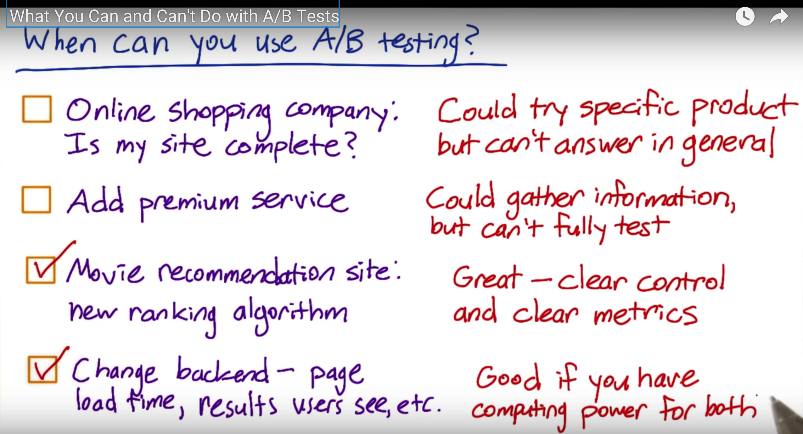
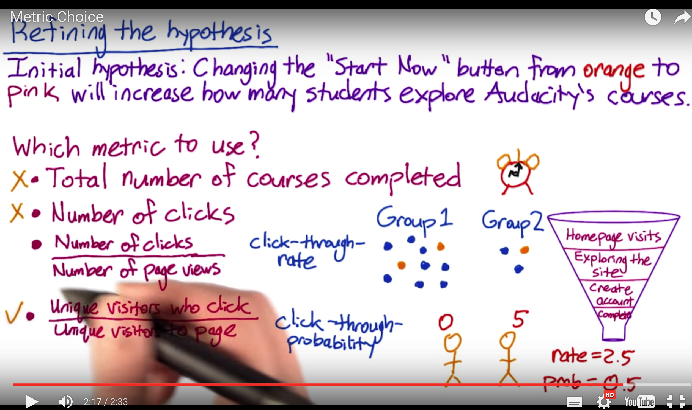
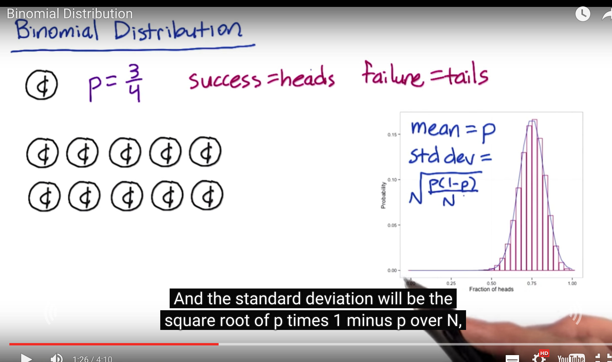
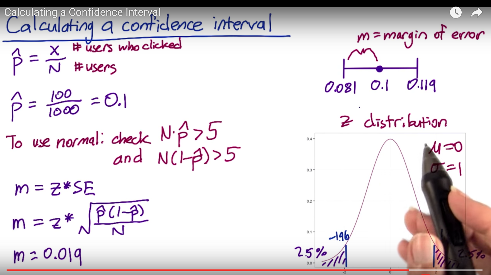
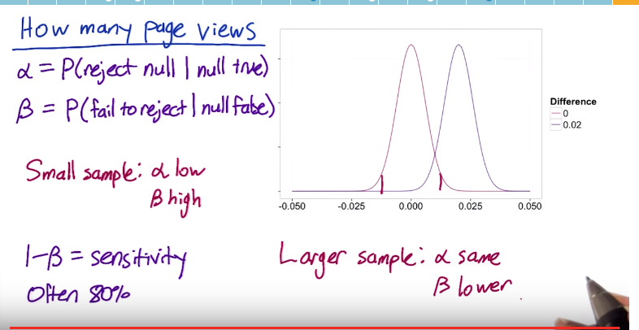
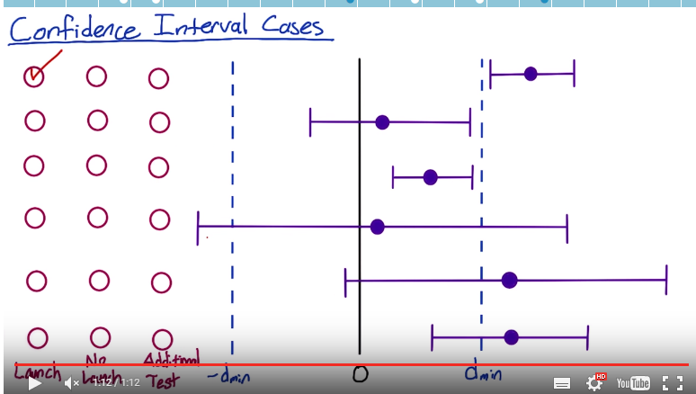
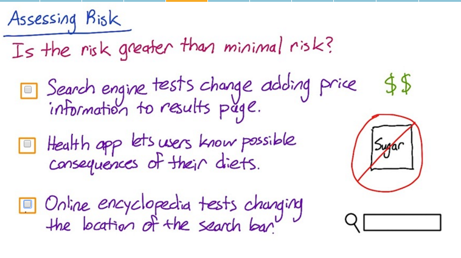
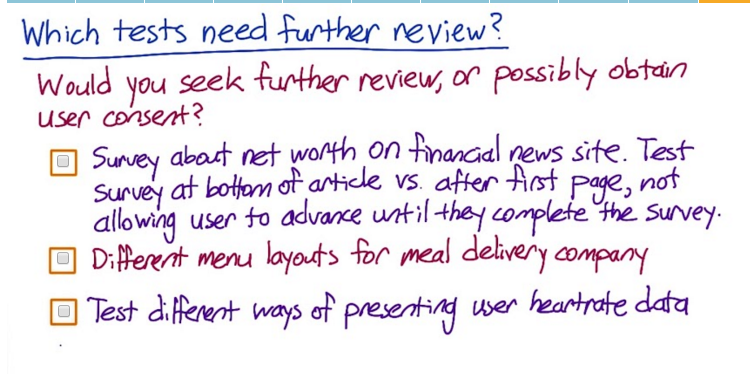

## A/B Testing Udacity 강좌 참고 
## https://www.udacity.com/course/viewer#!/c-ud257/l-4018018619/m-4114938608
### L1. Overview of A/B Testing
### L2. Policy and Ethics for experiments
#### L3. Choosing and Characterizing Metrics
#### L4. Designing an Experiment
#### L5. Analyzing Results
#### Final Project

## 1. 웹 사이트 최적화를 위한 밴디트 알고리즘

> 1. 두가지 특성, 탐색과 활용
> 2. 왜 멀티암드 밴디트 알고리즘을 사용하는가
> 3. 엡실론-그리디 알고리즘
> 4. 밴디트 알고리즘 디버깅
> 5. 소트프맥스 알고리즘
> 6. UCB-상부 신뢰 한계 알고리즘
> 7. 현실에서의 밴디트, 문제의 복잡성과 복합성
> 8. 결론

### A/B Testing
- In marketing and business intelligence, A/B testing is jargon for a randomized experiment with two variants, A and B, which are the control and variation in the controlled experiment .[1] A/B testing is a form of statistical hypothesis testing with two variants leading to the technical term, two-sample hypothesis testing, used in the field of statistics. Other terms used for this method include bucket tests and split-run testing but these terms can have a wider applicability to more than two variants. In online settings, such as web design (especially user experience design), the goal of A/B testing is to identify changes to web pages that increase or maximize an outcome of interest (e.g., click-through rate for a banner advertisement). Formally the current web page is associated with the null hypothesis.

### A-B Testing의 단점과 개선안 http://www.ecogwiki.com/A-B_Testing%EC%9D%98_%EB%8B%A8%EC%A0%90%EA%B3%BC_%EA%B0%9C%EC%84%A0%EC%95%88

### http://bahnsville.tistory.com/m/post/1091

### A : 대조군 Control
### B : 실험군 Experiment

### 평가지표, 평균 및 분산을 같이 봐야함. 신뢰구간 
### 통계적 오류들에서 pvalue의 유의성으로 판단하는 것은 항상 옳을 수는 없음.

    from IPython.display import Image
    Image(filename='png/1.png') 

    Image(filename='png/2.png')

    Image(filename='png/3.png')

    Image(filename='png/4.png')

    Image(filename='png/5.png')

    Image(filename='png/6.png')

    Image(filename='png/7.png')

    Image(filename='png/8.png')

    Image(filename='png/9.png')

    Image(filename='png/10.png')

    Image(filename='png/11.png')

    Image(filename='png/12.png')

    Image(filename='png/13.png')

    Image(filename='png/14.png')

    Image(filename='png/15.png')

    Image(filename='png/16.png')

    Image(filename='png/17.png')

    Image(filename='png/18.png')

### Pooled Estimator (합동추정량)
- P^pool : 합동추정량 (가중 평균이라고 보믄 됨), 모비율 검정차이 / 두 집단 독립 가정
- http://math7.tistory.com/104

### http://www.evanmiller.org/ab-testing/sample-size.html

    Image(filename='png/19.png')

    Image(filename='png/power.png')

    Image(filename='png/power2.png')

#### 통계적 오류
- 1종 오류는 귀무가설이 실제로 참이지만, 이에 불구하고 귀무가설을 잘못 기각하는 오류이다. 즉, 실제 음성인 것을 양성으로 판정하는 경우이다. 거짓 양성 또는 알파 오류(영어: α error)라고도 한다.
- 2종 오류는 귀무가설이 실제로 거짓이지만, 이에 불구하고 귀무가설을 잘못 채택하는 오류이다. 즉, 실제 양성인 것을 음성으로 판정하는 경우이다. 거짓 음성 또는 베타 오류(영어: β error)라고도 한다.

    Image(filename='png/20.png')

    Image(filename='png/21.png')

    Image(filename='png/22.png')

    Image(filename='png/23.png')

    Image(filename='png/24.png')

    Image(filename='png/25.png')

    Image(filename='png/26.png')

### Policy and Ethics for experiments
#### Four Principles of IRB's
- IRB는 ‘피험자의 권리, 안전, 복지 보호’를 목적으로 삼는다. 또한 취약한 환경에 있는 피험자가 임상시험에 참여하는 경우에는 그 이유의 타당성을 면밀히 검토하여야 한다.1) 사람을 대상으로 하는 모든 시험은 ‘사전에’ IRB 검토를 받고 승인을 받아 진행해야 한다 IRB에서는 과학적으로 문제가 있는 연구계획은 ‘비윤리적이다’라는 견해를 가지고 있으며 IRB의 설치 이유나 운영상의 각종 준수 사항은 모두 피험자의 권익보호에 그 초점이 맞추어져 있다. 이러한 목적을 전제로 IRB는 다음과 같은 심사결정을 내린다.
- https://ko.wikipedia.org/wiki/%EA%B8%B0%EA%B4%80%EC%83%9D%EB%AA%85%EC%9C%A4%EB%A6%AC%EC%9C%84%EC%9B%90%ED%9A%8C

    Image(filename='png/27.png')

    Image(filename='png/28.png')

### First Principle: Risk

- First, in the study, what risk is the participant undertaking? The main threshold is whether the risk exceeds that of “minimal risk”. Minimal risk is defined as the probability and magnitude of harm that a participant would encounter in normal daily life. The harm considered encompasses physical, psychological and emotional, social, and economic concerns. If the risk exceeds minimal risk, then informed consent is required. We’ll discuss informed consent further below. 

- In most, but not all, online experiments, it can certainly be debated as to whether any of the experiments lead to anything beyond minimal risk. What risk is a participant going to be exposed to if we change the ranking of courses on an educational site, or if we change the UI on an online game?

- Exceptions would certainly be any websites or applications that are health or financial related. In the Facebook experiment, for example, it can be debated as to whether participants were really being exposed to anything beyond minimal risk: all items shown were going to be in their feed anyway, it’s only a question of whether removing some of the posts led to increased risk.

    Image(filename='png/29.png')

    Image(filename='png/32.png')

####Second Principle: Benefits

- Next, what benefits might result from the study? Even if the risk is minimal, how might the results help? In most online A/B testing, the benefits are around improving the product. In other social sciences, it is about understanding the human condition in ways that might help, for example in education and development. In medicine, the risks are often higher but the benefits are often around improved health outcomes.

- It is important to be able to state what the benefit would be from completing the study.

####Third Principle: Alternatives

- Third, what other choices do participants have? For example, if you are testing out changes to a search engine, participants always have the choice to use another search engine. The main issue is that the fewer alternatives that participants have, the more issue that there is around coercion and whether participants really have a choice in whether to participate or not, and how that balances against the risks and benefits.

- For example, in medical clinical trials testing out new drugs for cancer, given that the other main choice that most participants face is death, the risk allowable for participants, given informed consent, is quite high.

- In online experiments, the issues to consider are what the other alternative services that a user might have, and what the switching costs might be, in terms of time, money, information, etc.

####Fourth Principle: Data Sensitivity

- Finally, what data is being collected, and what is the expectation of privacy and confidentiality? This last question is quite nuanced, encompassing numerous questions:

- Do participants understand what data is being collected about them? What harm would befall them should that data be made public?
- Would they expect that data to be considered private and confidential? For example, if participants are being observed in a public setting (e.g., a football stadium), there is really no expectation of privacy. If the study is on existing public data, then there is also no expectation of further confidentiality. If, however, new data is being gathered, then the questions come down to:

- What data is being gathered? How sensitive is it? Does it include financial and health data?
- Can the data being gathered be tied to the individual, i.e., is it considered personally identifiable?
- How is the data being handled, with what security? What level of confidentiality can participants expect?
- What harm would befall the individual should the data become public, where the harm would encompass health, psychological / emotional, social, and financial concerns?
- For example, often times, collected data from observed “public” behavior, surveys, and interviews, if the data were not personally identifiable, would be considered exempt from IRB review (reference: NSF FAQ below).

- To summarize, there are really three main issues with data collection with regards to experiments:

- For new data being collected and stored, how sensitive is the data and what are the internal safeguards for handling that data? E.g., what access controls are there, how are breaches to that security caught and managed, etc.?
- Then, for that data, how will it be used and how will participants’ data be protected? How are participants guaranteed that their data, which was collected for use in the study, will not be used for some other purpose? This becomes more important as the sensitivity of the data increases.
- Finally, what data may be published more broadly, and does that introduce any additional risk to the participants?

    Image(filename='png/30.png')

####가상의 A/B 테스트 실험 (윤리적인것인지에 대한 추가 검토를 받을지 유무)
1. 뉴스 웹사이트 (제공기사 인덱스 펀드 투자 또는 개별주식 선택) 설문조사에 참여하는 사용자들에게 다양한 방법으로 테스트. 문서 하단에 설문 조사에 참여하는 옵션. 문서 하단에 설문조사에 참여하려는 옵션. 응답할 때까지 두번 째 페이지를 계속할 수 없음. 
2. 식사를 제공하는 회사, 메뉴의 다른 레이아웃을 테스트. 
3. 심장 박동을 측정하는 회사, 사용자가 다양한 활동을 하는 동안 자신의 삼장 박동을 추적할 수 있는 응용 프로그램. 추가 테스트 필요.

    Image(filename='png/31.png')

