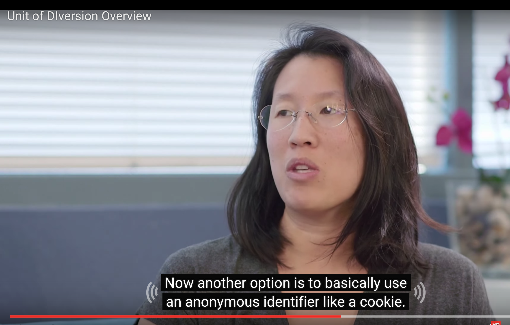

### A/B Testing 의사결정RL Part2 4회차 스터디

- In marketing and business intelligence, A/B testing is jargon for a randomized experiment with two variants, A and B, which are the control and variation in the controlled experiment .[1] A/B testing is a form of statistical hypothesis testing with two variants leading to the technical term, two-sample hypothesis testing, used in the field of statistics. Other terms used for this method include bucket tests and split-run testing but these terms can have a wider applicability to more than two variants. In online settings, such as web design (especially user experience design), the goal of A/B testing is to identify changes to web pages that increase or maximize an outcome of interest (e.g., click-through rate for a banner advertisement). Formally the current web page is associated with the null hypothesis.

https://www.udacity.com/course/viewer#!/c-ud257/l-4018018619/m-4114938608

#### L1. Overview of A/B Testing

#### L2. Policy and Ethics for experiments

#### L3. Choosing and Characterizing Metrics

### L4. Designing an Experiment

### L5. Analyzing Results


```python
from IPython.display import Image
Image(filename='img/1.png') 
```


```python
Image(filename='img/2.png') 
```


```python
Image(filename='img/3.png') 
```





```python
Image(filename='img/4.png') 
```


```python
Image(filename='img/5.png') 
```


```python
Image(filename='img/6.png') 
```


```python
Image(filename='img/7.png') 
```


```python
Image(filename='img/8.png') 
```


```python
Image(filename='img/9.png') 
```


```python
Image(filename='img/10.png')
```


```python
Image(filename='img/11.png')
```


```python
Image(filename='img/12.png')
```


```python
Image(filename='img/13.png')
```


```python
Image(filename='img/14.png')
```


```python
Image(filename='img/15.png')
```


```python
Image(filename='img/16.png')
```


```python
Image(filename='img/17.png')
```


```python
Image(filename='img/18.png')
```


```python
Image(filename='img/19.png')
```


```python
Image(filename='img/20.png')
```


```python
Image(filename='img/21.png')
```


```python
Image(filename='img/22.png')
```


```python
Image(filename='img/23.png')
```


```python
Image(filename='img/24.png')
```


```python
Image(filename='img/25.png')
```


```python
Image(filename='img/26.png')
```


```python
Image(filename='img/27.png')
```


### L5. Analyzing Results


```python
Image(filename='img/28.png')
```


```python
Image(filename='img/29.png')
```


```python
Image(filename='img/30.png')
```


```python
Image(filename='img/31.png')
```


```python
Image(filename='img/32.png')
```


```python
Image(filename='img/33.png')
```


```python
Image(filename='img/34.png')
```


```python
Image(filename='img/35.png')
```


```python
Image(filename='img/36.png')
```


```python
Image(filename='img/37.png')
```


```python
Image(filename='img/38.png')
```


```python
Image(filename='img/39.png')
```


```python
Image(filename='img/40.png')
```


```python
Image(filename='img/41.png')
```


```python
Image(filename='img/42.png')
```


```python
Image(filename='img/44.png')
```


