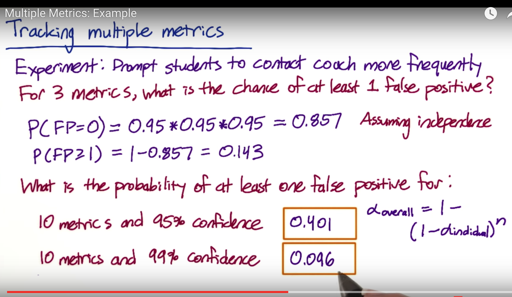
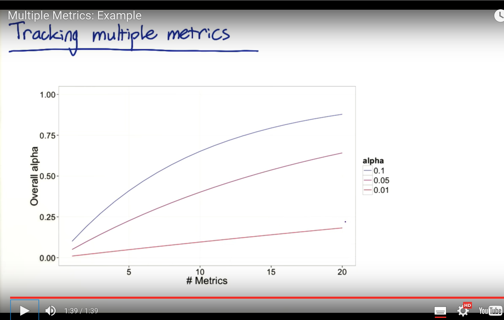
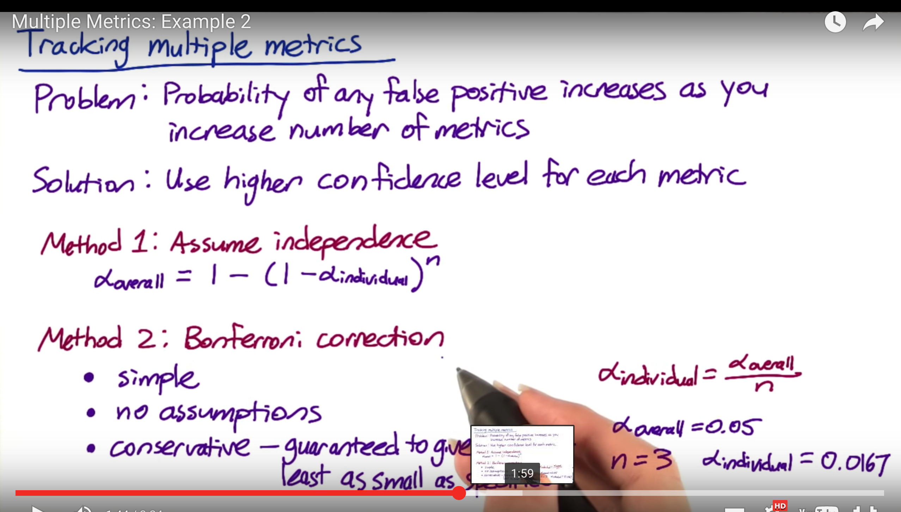
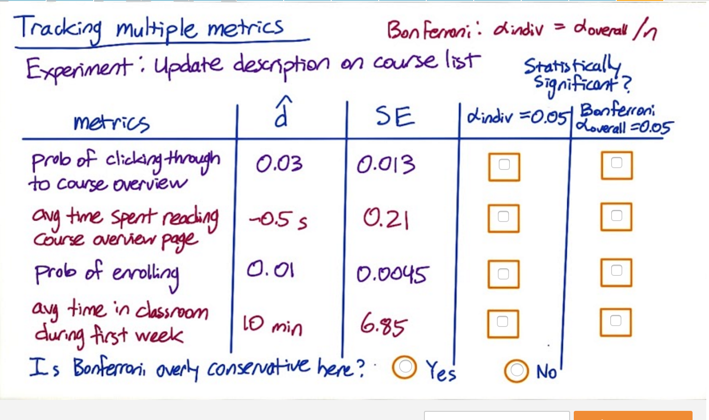
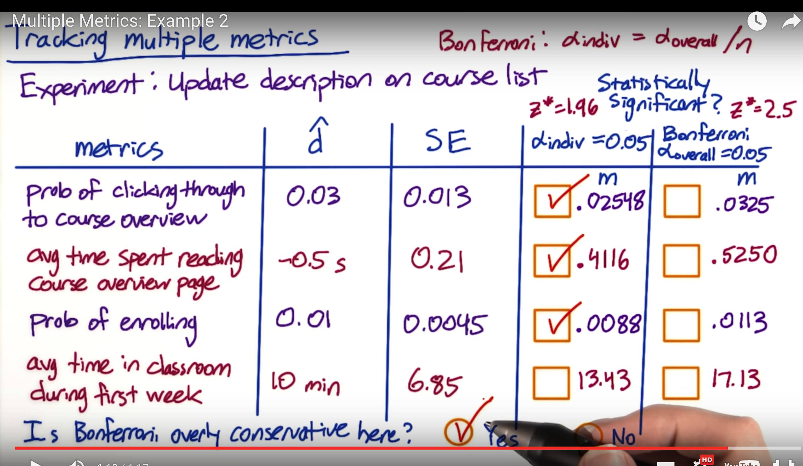
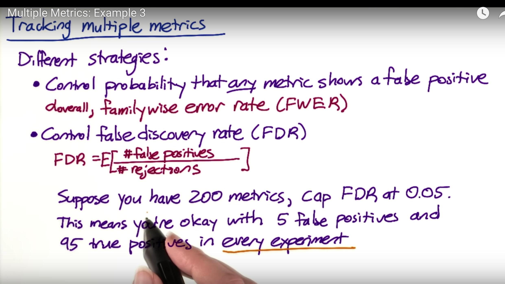

```python
from IPython.display import Image
Image(filename='img/43_2.png') 
```





```python
Image(filename='img/44.png')
```





```python
Image(filename='img/45.png')
```





```python
Image(filename='img/46.png')
```





```python
Image(filename='img/47.png')
```





```python
Image(filename='img/48.png')
```





