## A/B Testing Udacity 강좌 참고 
## https://www.udacity.com/course/viewer#!/c-ud257/l-4018018619/m-4114938608
#### L1. Overview of A/B Testing
#### L2. Policy and Ethics for experiments
### L3. Choosing and Characterizing Metrics
#### L4. Designing an Experiment
#### L5. Analyzing Results
#### Final Project

### A/B Testing
- In marketing and business intelligence, A/B testing is jargon for a randomized experiment with two variants, A and B, which are the control and variation in the controlled experiment .[1] A/B testing is a form of statistical hypothesis testing with two variants leading to the technical term, two-sample hypothesis testing, used in the field of statistics. Other terms used for this method include bucket tests and split-run testing but these terms can have a wider applicability to more than two variants. In online settings, such as web design (especially user experience design), the goal of A/B testing is to identify changes to web pages that increase or maximize an outcome of interest (e.g., click-through rate for a banner advertisement). Formally the current web page is associated with the null hypothesis.

### When choosing a metric
- there's a couple of thing that we need to know. It's the definition of the metris, build the intuition from it by performing sanity check and sensitivity test, and then characterize the metric by evaluation

- Invariance metric vs Evaluation metric

- Invariance metrics is performing some kind of sanity check for us before running the experiment, like checking whether the distribution is the same. It performing some consistent checking across all of our experiments, which is why it shouldn't be changed. Otherwise we have to start it all over again. Some changed because we want to increase number of users involved.

- Evaluation metrics, is usually the business metris, like for example market share, number of users, or user experience metrics. Sometime it measure what previously stated as taking long time because it doesn't contain enough information, like measure user that got a job after taking MOOC. This is a difficult metrics which require special technique, as discussed in next blog.

    from IPython.display import Image
    Image(filename='png/1.png') 

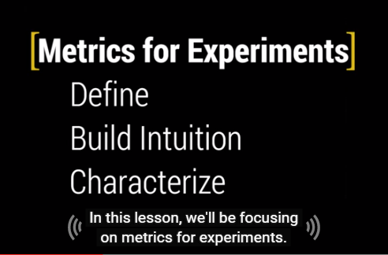

###The first step is you want to come up with a high level concept for a metric.
- Active users.
- Click-through probability.

###The Second step is to really figure out all of the nitty gritty details.
- How do you define what active is? 7? 28?

### The thrid step is that you are taking all of these individual data.
- you need to summarize them into a single metric.
- You can create a composite metric. (objective function / overall evaluation criterion / combines all of these different metrics.)
- Composite metrics have different weighted function for different metric. 

    Image(filename='png/1-2.png') 

    Image(filename='png/2.png') 

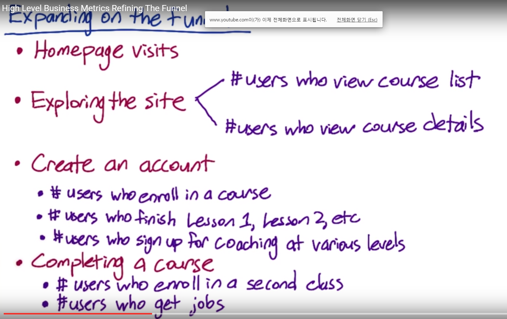

    Image(filename='png/4.png') 

    Image(filename='png/5.png') 

    Image(filename='png/6.png') 

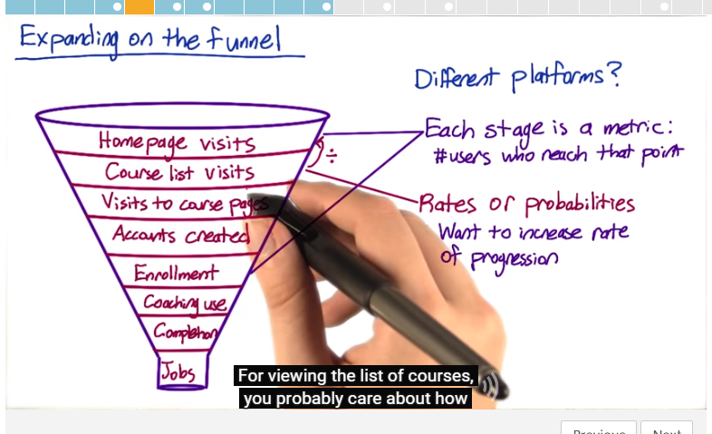

    Image(filename='png/7.png') 

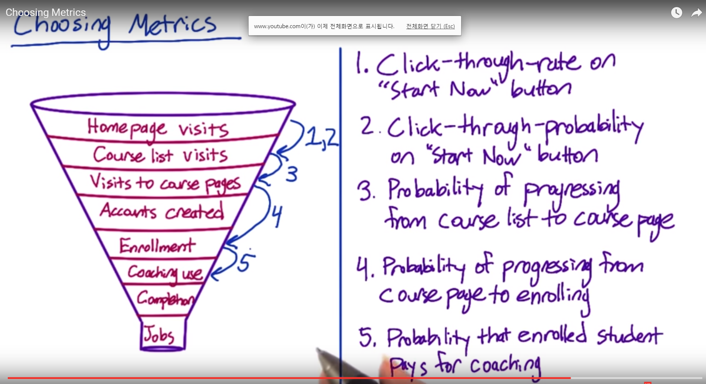

    Image(filename='png/8.png') 

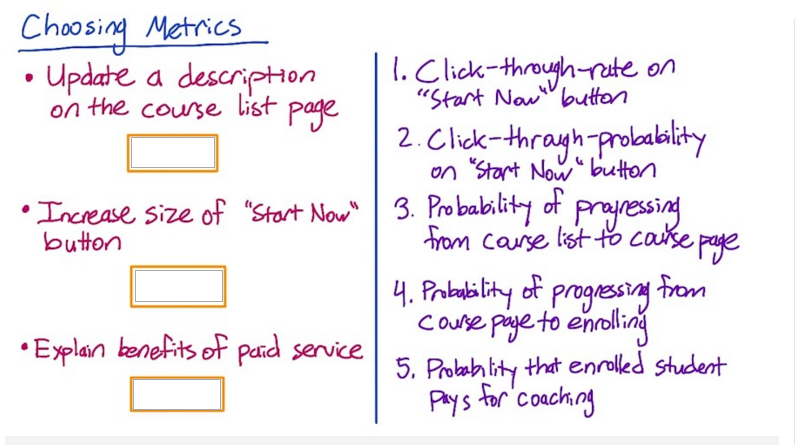

    Image(filename='png/9.png') 

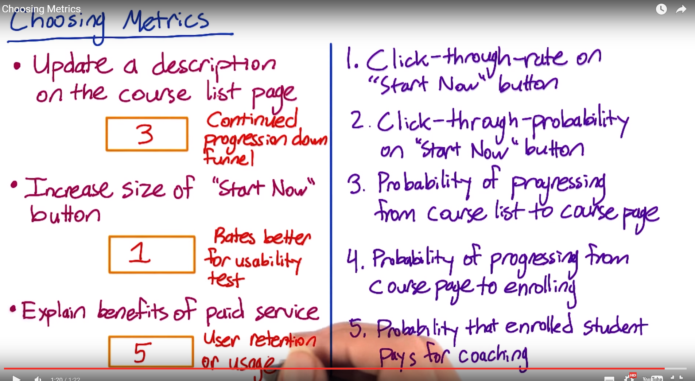

    Image(filename='png/10.png') 

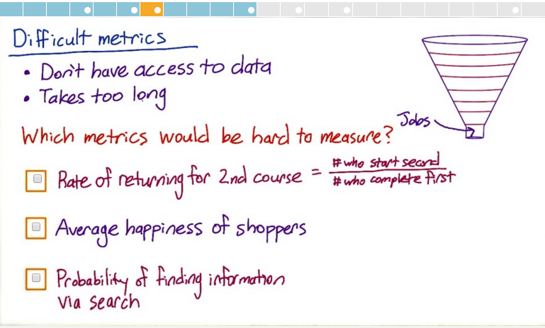

    Image(filename='png/11.png')  #Getting a Job Long process...

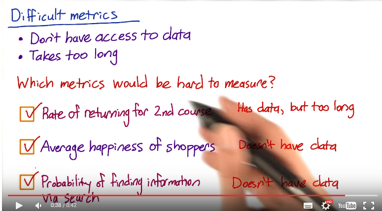

### But Students could take a long time between completing one course and signing up for another. So this metric probably takes too long to measure during most A/B tests.

### Techniques to Gather Additional Data
- There’s outside market share data
- There are also companies such as Nielsen , Forrester , and Pew Research that run and publish their own studies.
- There are higher level aggregators of data, such as eMarketer , who provide summaries from all of these sources in easily consumable fashion.
- 외부 업체를 고용하는 것 (UER : User Experience Research (UER), focus groups, and surveys...)

####UER
- With UER, you can go really deep with a few users, either in a lab or even in a field study. This is the most in-depth and intensive, and can be a combination of observing users doing tasks and asking them questions. The idea is to spot problems and draw insights from the observations and timely questions. This can be useful for generating hypotheses for problems that you might want to tackle fixing in experiments. 

####Focus Groups
- In focus grous, you recruit a bunch of users or potential users and bring them together for a group discussion. Once you bring the users together, you could show them screenshots or images, or you can walk them through a demo, and then you can ask them questions to elicit feedback.

####Surveys
- The final method is to run surveys or questionnaires, where you recruit a population and ask them to answer a bunch of questions. The number of questions can vary, as can the type of question. You can have multiple-choice answers, or open-ended questions where users give a free-form response. These can be done online, either on your site or other methods of reaching and targeting users, such as Google’s
Consumer Surveys . The main advantage of surveys is that you can typically reach thousands of users, if not more. The disadvantages are that the data is self-reported and users don’t always give full or truthful answers, even if the survey is anonymous. 

    Image(filename='png/12.png')

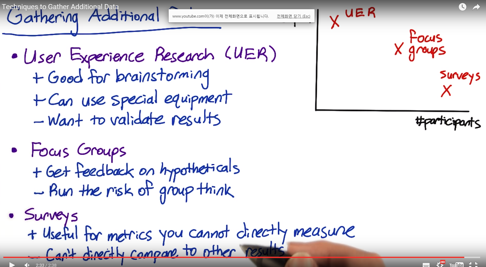

    Image(filename='png/12-2.png')

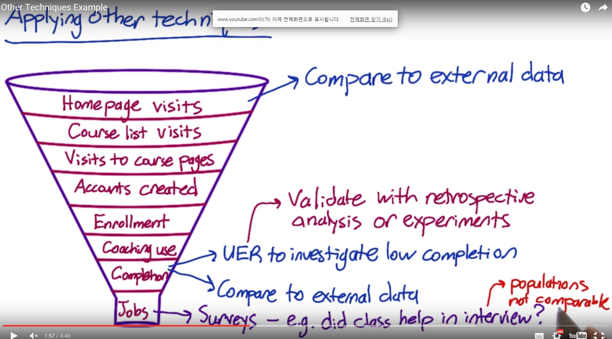

    Image(filename='png/13.png')

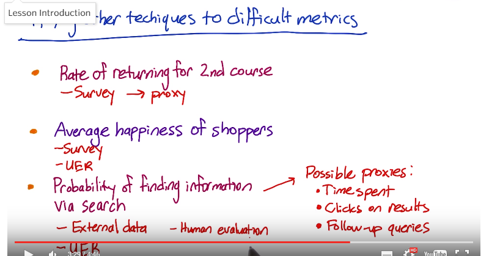

###Metric Definition and Data Capture

- The first step is to fully define exactly what data (메트릭 계산)
- The Scond step is given those events, how do i summarize my metric?
- 11:50분에 접속해서 12:01분에 클릭할 경우?

- Def #1 (Cookie probability): For each <time interval>, number of cookies that click divided by number of cookies
- Def #2 (Pageview probability): Number of pageviews with a click within <time interval> divided by number of pageviews
- Def #3 (Rate): Number of clicks divided by number of pageviews

    Image(filename='png/14.png')

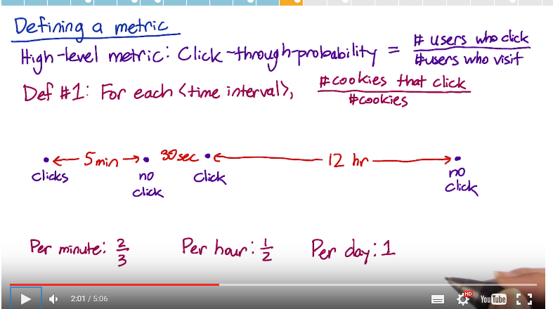

    Image(filename='png/15.png')

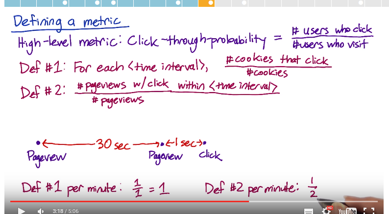

    Image(filename='png/16.png')

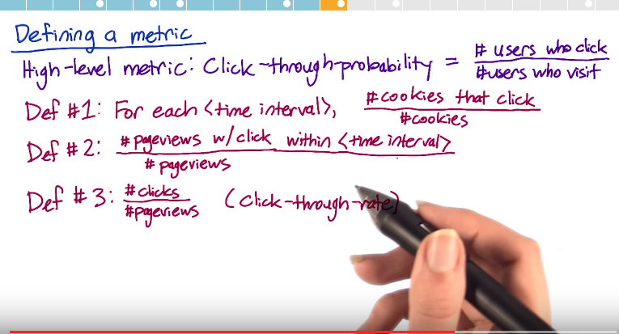

    Image(filename='png/17.png')

    Image(filename='png/18.png')

    Image(filename='png/19.png')

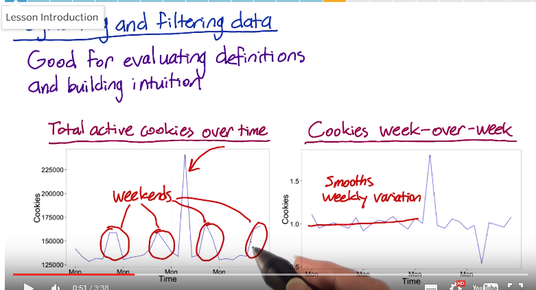

    Image(filename='png/20.png')

    Image(filename='png/21.png')

    Image(filename='png/22.png')

    Image(filename='png/23.png')

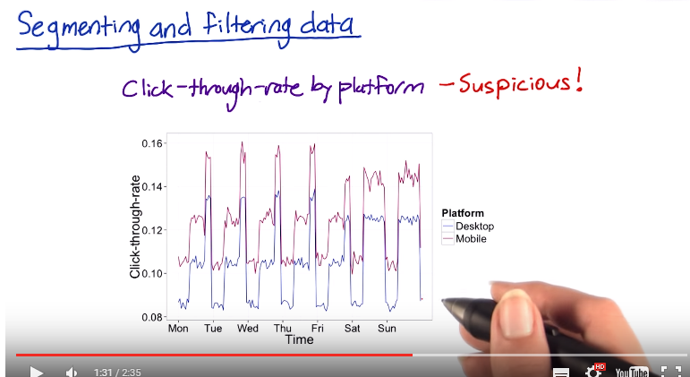

    Image(filename='png/24.png')

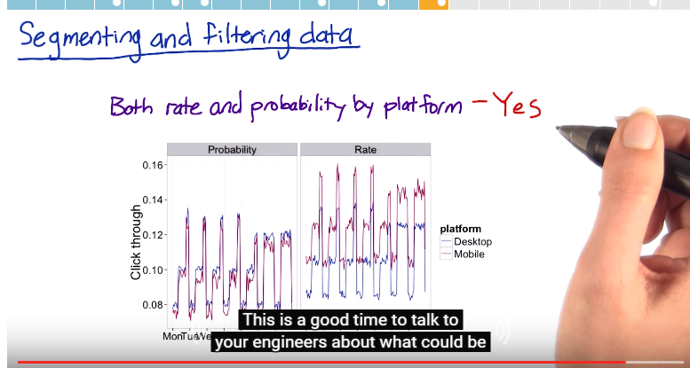

    Image(filename='png/25.png')

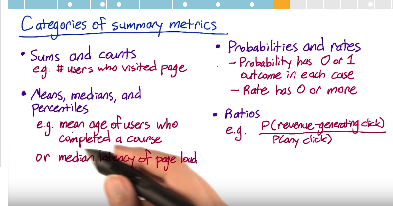

    Image(filename='png/26.png')

    Image(filename='png/27_2.png')

    Image(filename='png/27.png')

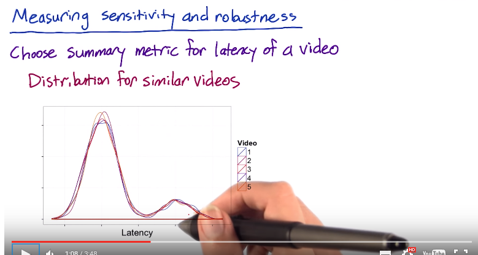

    Image(filename='png/28.png') 

    Image(filename='png/29.png') #highest : range of resolutions 

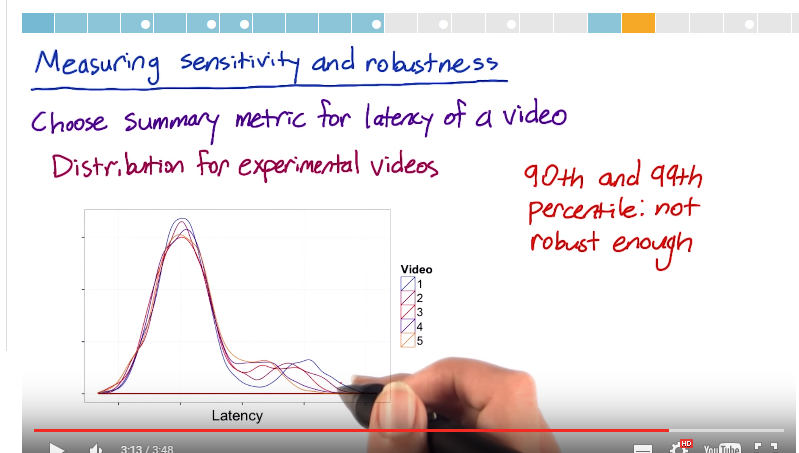

    Image(filename='png/30.png')

    Image(filename='png/31.png')

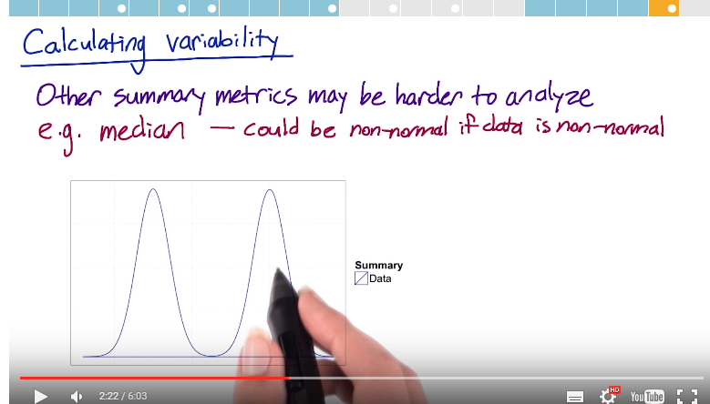

    Image(filename='png/32.png')

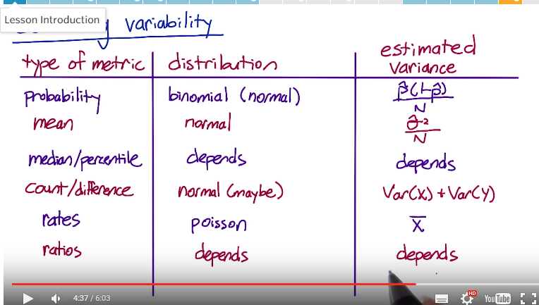

    Image(filename='png/33.png')

    import numpy as np
    
    arr = np.array([87029, 113407, 84843, 104994, 99327, 92052, 60684])
    x = arr.mean()
    sd = arr.std(ddof=1)
    se =sd/np.sqrt(arr.shape[0])
    me = 1.96 * se
    (x-me,x+me)

    (79157.543327940279, 104367.02810063114)

    Image(filename='png/34.png')

### Common distributions in online data

- Let’s talk about some common distributions that come up when you look at real user data.

- For example, let’s measure the rate at which users click on a result on our search page, analogously, we could measure the average staytime on the results page before traveling to a result. In this case, you’d probably see what we call a Poisson distribution, or that the stay times would be exponentially distributed.

- Another common distribution of user data is a “power-law,” Zipfian or Pareto distribution. That basically means that the probability of a more extreme value, z, decreases like 1/z (or 1/z^exponent). This distribution also comes up in other rare events such as the frequency of words in a text (the most common word is really really common compared to the next word on the list). These types of heavy-tailed distributions are common in internet data.

- Finally, you may have data that is a composition of different distributions - latency often has this characteristic because users on fast internet connection form one group and users on dial-up or cell phone networks form another. Even on mobile phones you may have differences between carriers, or newer cell phones vs. older text-based displays. This forms what is called a mixture distribution that can be hard to detect or characterize well.

- The key here is not to necessarily come up with a distribution to match if the answer isn’t clear - that can be helpful - but to choose summary statistics that make the most sense for what you do have. If you have a distribution that is lopsided with a very long tail, choosing the mean probably doesn’t work for you very well - and in the case of something like the Pareto, the mean may be infinite!

### Absolute vs. relative difference

- Suppose you run an experiment where you measure the number of visits to your homepage, and you measure 5000 visits in the control and 7000 in the experiment. Then the absolute difference is the result of subtracting one from the other, that is, 2000. The relative difference is the absolute difference divided by the control metric, that is, 40%.

- Relative differences in probabilities

- For probability metrics, people often use percentage points to refer to absolute differences and percentages to refer to relative differences. For example, if your control click-through-probability were 5%, and your experiment click-through-probability were 7%, the absolute difference would be 2 percentage points, and the relative difference would be 40 percent. However, sometimes people will refer to the absolute difference as a 2 percent change, so if someone gives you a percentage, it's important to clarify whether they mean a relative or absolute difference!

#### 2.2 Non-parametric methods
- This is a way to analyze data without making an assumption about the distribution. At Google, it was observed that the analytical estimates of variance was often under-estimated, and therefore they have resorted to use empirical measurements based on A/A test to evaluate variance. If you see a lot of variability in a metric in an A/A test, it is probably too sensitive to be used. One way is to do a large A/A test, and then do bootstrap to generate small groups and test the variability.

####With A/A tests, we can
- Compare result to what you expect (sanity check)
- Estimate variance empirically and use your assumption about the distribution to calculate confidence
- Directly estimate confidence interval without making any assumption of the data

- For a lot of analysts, a majority of the time is spent is validating and choosing a metric compared to actually running the experiment. Being able to standardize the definitions was critical in the test. When measuring latency, are you talking about when the first byte loads and when a last byte loads. Also, for latency, the mean may not change at all. The signals (e.g. slow/fast connections or browsers) causes lumps in the distribution, and no central measure works. One needs to look at the right percentile metric. The key thing is that you are building intuition, you have to understand data, and the business, and work with the engineers to understand how the data is being captured.

### http://napitupulu-jon.appspot.com/posts/variability-abtesting-udacity.html
#### A/A Testing
- A/A testing differs from A/B testing. in the sense that A/B is for A(control) and B(experiment), we want to detect changes that we care about, A/A testing is for control vs control groups. We want to identify changes that we don't know (lurking variables) that makes variability of our data.

- A/A usually required to have larger sample size, as we now standard deviation (SE) minimized by quadratical increase of our sample size. This is tends to be expensive, gathering sample size. The alternative to this is using one big experiment or bootstrapping, chunking into smaller part and use an experiment on that. We don't always use bootstrap if it doesn't agree with our analytical variance. We have to use big 

    Image(filename='png/35.png')

    Image(filename='png/36.png')

    Image(filename='png/37.png')

    Image(filename='png/38.png')

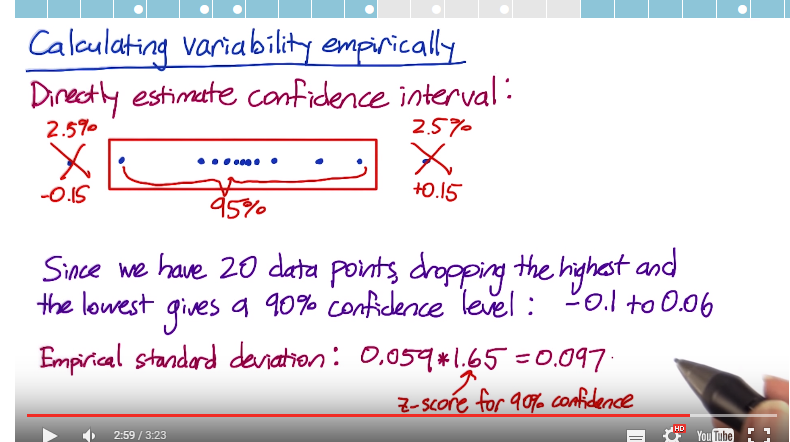

    Image(filename='png/39.png')

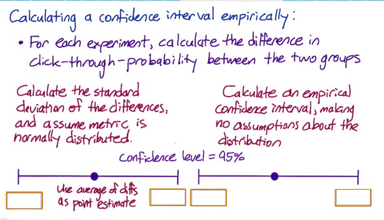

    a = """0.02
    0.11
    0.14
    0.05
    0.09
    0.11
    0.09
    0.1
    0.14
    0.08
    0.09
    0.08
    0.09
    0.08
    0.12
    0.09
    0.16
    0.11
    0.12
    0.11
    0.06
    0.11
    0.13
    0.1
    0.08
    0.14
    0.1
    0.08
    0.12
    0.09
    0.14
    0.1
    0.08
    0.08
    0.07
    0.13
    0.11
    0.08
    0.1
    0.11"""
    
    
    b = """0.07
    0.11
    0.05
    0.07
    0.1
    0.07
    0.1
    0.1
    0.12
    0.14
    0.04
    0.07
    0.07
    0.06
    0.15
    0.09
    0.12
    0.1
    0.08
    0.09
    0.08
    0.08
    0.14
    0.09
    0.1
    0.08
    0.08
    0.09
    0.08
    0.11
    0.11
    0.1
    0.14
    0.1
    0.08
    0.05
    0.19
    0.11
    0.08
    0.13"""

    a

    '0.02\n0.11\n0.14\n0.05\n0.09\n0.11\n0.09\n0.1\n0.14\n0.08\n0.09\n0.08\n0.09\n0.08\n0.12\n0.09\n0.16\n0.11\n0.12\n0.11\n0.06\n0.11\n0.13\n0.1\n0.08\n0.14\n0.1\n0.08\n0.12\n0.09\n0.14\n0.1\n0.08\n0.08\n0.07\n0.13\n0.11\n0.08\n0.1\n0.11'

    b

    '0.07\n0.11\n0.05\n0.07\n0.1\n0.07\n0.1\n0.1\n0.12\n0.14\n0.04\n0.07\n0.07\n0.06\n0.15\n0.09\n0.12\n0.1\n0.08\n0.09\n0.08\n0.08\n0.14\n0.09\n0.1\n0.08\n0.08\n0.09\n0.08\n0.11\n0.11\n0.1\n0.14\n0.1\n0.08\n0.05\n0.19\n0.11\n0.08\n0.13'

    arr_a = np.array(a.split('\n'),dtype='float32')
    arr_b = np.array(b.split('\n'),dtype='float32')

    arr_a

    array([ 0.02,  0.11,  0.14,  0.05,  0.09,  0.11,  0.09,  0.1 ,  0.14,
            0.08,  0.09,  0.08,  0.09,  0.08,  0.12,  0.09,  0.16,  0.11,
            0.12,  0.11,  0.06,  0.11,  0.13,  0.1 ,  0.08,  0.14,  0.1 ,
            0.08,  0.12,  0.09,  0.14,  0.1 ,  0.08,  0.08,  0.07,  0.13,
            0.11,  0.08,  0.1 ,  0.11], dtype=float32)

    arr_b

    array([ 0.07      ,  0.11      ,  0.05      ,  0.07      ,  0.1       ,
            0.07      ,  0.1       ,  0.1       ,  0.12      ,  0.14      ,
            0.04      ,  0.07      ,  0.07      ,  0.06      ,  0.15000001,
            0.09      ,  0.12      ,  0.1       ,  0.08      ,  0.09      ,
            0.08      ,  0.08      ,  0.14      ,  0.09      ,  0.1       ,
            0.08      ,  0.08      ,  0.09      ,  0.08      ,  0.11      ,
            0.11      ,  0.1       ,  0.14      ,  0.1       ,  0.08      ,
            0.05      ,  0.19      ,  0.11      ,  0.08      ,  0.13      ], dtype=float32)

    a_sim = np.random.choice(arr_a,size=100)
    b_sim = np.random.choice(arr_b,size=100)

    a_sim

    array([ 0.09,  0.08,  0.1 ,  0.1 ,  0.1 ,  0.08,  0.1 ,  0.14,  0.09,
            0.05,  0.14,  0.1 ,  0.11,  0.08,  0.11,  0.11,  0.07,  0.06,
            0.08,  0.13,  0.07,  0.09,  0.16,  0.11,  0.11,  0.09,  0.09,
            0.14,  0.06,  0.11,  0.02,  0.12,  0.12,  0.1 ,  0.14,  0.14,
            0.09,  0.08,  0.08,  0.08,  0.02,  0.13,  0.13,  0.1 ,  0.11,
            0.06,  0.07,  0.09,  0.12,  0.12,  0.09,  0.11,  0.08,  0.14,
            0.09,  0.08,  0.08,  0.14,  0.11,  0.12,  0.02,  0.08,  0.08,
            0.11,  0.09,  0.09,  0.08,  0.08,  0.1 ,  0.16,  0.09,  0.12,
            0.09,  0.08,  0.11,  0.1 ,  0.14,  0.1 ,  0.12,  0.08,  0.08,
            0.08,  0.08,  0.11,  0.09,  0.13,  0.09,  0.09,  0.11,  0.08,
            0.12,  0.09,  0.09,  0.14,  0.14,  0.02,  0.1 ,  0.11,  0.08,  0.14], dtype=float32)

    b_sim

    array([ 0.15000001,  0.09      ,  0.14      ,  0.19      ,  0.13      ,
            0.04      ,  0.09      ,  0.04      ,  0.08      ,  0.1       ,
            0.05      ,  0.11      ,  0.08      ,  0.15000001,  0.08      ,
            0.15000001,  0.09      ,  0.07      ,  0.08      ,  0.1       ,
            0.11      ,  0.09      ,  0.09      ,  0.09      ,  0.14      ,
            0.08      ,  0.05      ,  0.1       ,  0.06      ,  0.13      ,
            0.14      ,  0.09      ,  0.09      ,  0.14      ,  0.07      ,
            0.08      ,  0.07      ,  0.11      ,  0.14      ,  0.08      ,
            0.05      ,  0.11      ,  0.08      ,  0.04      ,  0.09      ,
            0.08      ,  0.09      ,  0.05      ,  0.11      ,  0.08      ,
            0.07      ,  0.05      ,  0.04      ,  0.1       ,  0.11      ,
            0.08      ,  0.08      ,  0.08      ,  0.05      ,  0.12      ,
            0.08      ,  0.08      ,  0.13      ,  0.04      ,  0.06      ,
            0.08      ,  0.12      ,  0.1       ,  0.08      ,  0.12      ,
            0.05      ,  0.15000001,  0.1       ,  0.07      ,  0.09      ,
            0.07      ,  0.08      ,  0.13      ,  0.07      ,  0.1       ,
            0.08      ,  0.19      ,  0.08      ,  0.07      ,  0.1       ,
            0.11      ,  0.08      ,  0.12      ,  0.14      ,  0.1       ,
            0.14      ,  0.15000001,  0.09      ,  0.13      ,  0.11      ,
            0.12      ,  0.11      ,  0.1       ,  0.1       ,  0.09      ], dtype=float32)

    diff = (arr_a - arr_b)
    avg_diff = diff.mean()
    std_diff = diff.std()
    ME = 1.96*std_diff

    (avg_diff-ME,avg_diff+ME)

    (-0.066131130196154117, 0.074631130658090114)

    #40 data points, 95% CI can be gained by subtracting 2 points at max and min (because CI two-tailed)
    diff.sort()
    diff2 = diff[1:-1]
    (diff2.min(),diff2.max())

    (-0.060000002, 0.079999998)

    Image(filename='png/40.png')

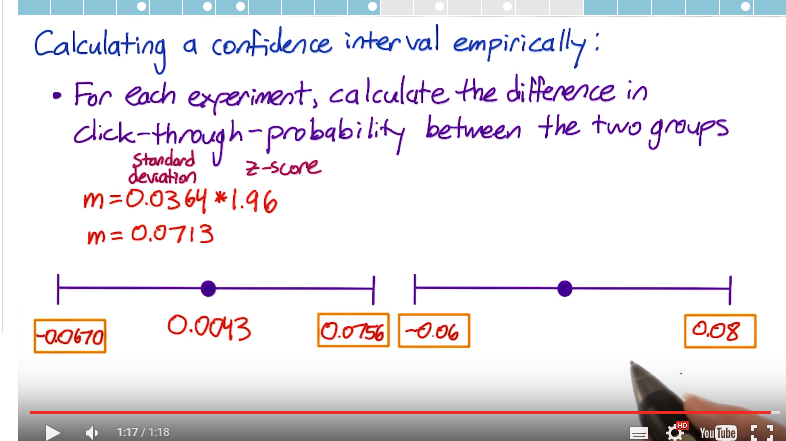

