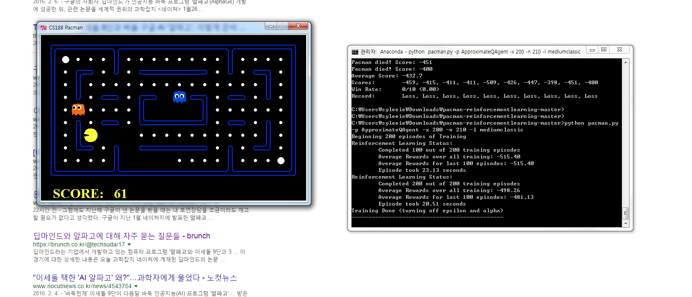

### Python Project 3: Reinforcement Learning

- 원문 : http://inst.eecs.berkeley.edu/~cs188/fa10/projects/reinforcement/reinforcement.html
- 수정본 : https://github.com/lightninglu10/pacman-reinforcementlearning
- 알파고 
[1] http://platum.kr/archives/56039
[2] https://namu.wiki/w/%EC%95%8C%ED%8C%8C%EA%B3%A0

- python gridworld.py -h
Usage: gridworld.py [options]

~~~~
Options:
  -h, --help            show this help message and exit
  -d DISCOUNT, --discount=DISCOUNT
                        Discount on future (default 0.9)
  -r R, --livingReward=R
                        Reward for living for a time step (default 0.0)
  -n P, --noise=P       How often action results in unintended direction (default 0.2)
  -e E, --epsilon=E     Chance of taking a random action in q-learning  (default 0.3)
  -l P, --learningRate=P
                        TD learning rate (default 0.5)
  -i K, --iterations=K  Number of rounds of value iteration (default 10)
  -k K, --episodes=K    Number of epsiodes of the MDP to run (default 1)
  -g G, --grid=G        Grid to use (case sensitive; options are BookGrid,
                        BridgeGrid, CliffGrid, MazeGrid, default BookGrid)
  -w X, --windowSize=X  Request a window width of X pixels *per grid cell*  (default 150)
  -a A, --agent=A       Agent type (options are 'random', 'value' and 'q', default random)
  -t, --text            Use text-only ASCII display
  -p, --pause           Pause GUI after each time step when running the MDP
  -q, --quiet           Skip display of any learning episodes
  -s S, --speed=S       Speed of animation, S > 1.0 is faster, 0.0 < S < 1.0  is slower (default 1.0)
  -m, --manual          Manually control agent
  -v, --valueSteps      Display each step of value iteration
  
~~~~

- python pacman.py -h

~~~
Usage:
    USAGE:      python pacman.py <options>
    EXAMPLES:   (1) python pacman.py
                    - starts an interactive game
                (2) python pacman.py --layout smallClassic --zoom 2
                OR  python pacman.py -l smallClassic -z 2
                    - starts an interactive game on a smaller board, zoomed in

Options:
  -h, --help            show this help message and exit
  -n GAMES, --numGames=GAMES
                        the number of GAMES to play [Default: 1]
  -l LAYOUT_FILE, --layout=LAYOUT_FILE
                        the LAYOUT_FILE from which to load the map layout
                        [Default: mediumClassic]
  -p TYPE, --pacman=TYPE
                        the agent TYPE in the pacmanAgents module to use
                        [Default: KeyboardAgent]
  -t, --textGraphics    Display output as text only
  -q, --quietTextGraphics
                        Generate minimal output and no graphics
  -g TYPE, --ghosts=TYPE
                        the ghost agent TYPE in the ghostAgents module to use
                        [Default: RandomGhost]
  -k NUMGHOSTS, --numghosts=NUMGHOSTS
                        The maximum number of ghosts to use [Default: 4]
  -z ZOOM, --zoom=ZOOM  Zoom the size of the graphics window [Default: 1.0]
  -f, --fixRandomSeed   Fixes the random seed to always play the same game
  -r, --recordActions   Writes game histories to a file (named by the time
                        they were played)
  --replay=GAMETOREPLAY
                        A recorded game file (pickle) to replay
  -a AGENTARGS, --agentArgs=AGENTARGS
                        Comma separated values sent to agent. e.g.
                        "opt1=val1,opt2,opt3=val3"
  -x NUMTRAINING, --numTraining=NUMTRAINING
                        How many episodes are training (suppresses output)
                        [Default: 0]
  --frameTime=FRAMETIME
                        Time to delay between frames; <0 means keyboard
                        [Default: 0.1]
  -c, --catchExceptions
                        Turns on exception handling and timeouts during games
  --timeout=TIMEOUT     Maximum length of time an agent can spend computing in
                        a single game [Default: 30]
                        
~~~

    from IPython.display import Image
    Image(filename='1.png') 

